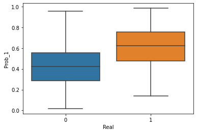

# Prevendo a rotatividade de clientes de uma empresa de Telecom
### Projeto nº4 da Formação Cientista de Dados da Data Science Academy
O objetivo é trabalho é criar um modelo de aprendizagem de máquina que possa prever se um cliente pode ou não cancelar seu plano e qual a probabilidade de isso ocorrer.

Para isto, são fornecidos um dataset de treinamento e também um dataset de teste para mensuração final do resultado do modelo.

Será utilizada a a métrica do R^2 para avaliação dos modelos de machine learning criados.


```python
import pandas as pd
import numpy as np
import matplotlib.pyplot as plt
```

### Análise Exploratória de Dados


```python
df = pd.read_csv('data/projeto4_telecom_treino.csv')
df
```


<div>
<style scoped>
    .dataframe tbody tr th:only-of-type {
        vertical-align: middle;
    }

    .dataframe tbody tr th {
        vertical-align: top;
    }

    .dataframe thead th {
        text-align: right;
    }
</style>
<table border="1" class="dataframe">
  <thead>
    <tr style="text-align: right;">
      <th></th>
      <th>Unnamed: 0</th>
      <th>state</th>
      <th>account_length</th>
      <th>area_code</th>
      <th>international_plan</th>
      <th>voice_mail_plan</th>
      <th>number_vmail_messages</th>
      <th>total_day_minutes</th>
      <th>total_day_calls</th>
      <th>total_day_charge</th>
      <th>...</th>
      <th>total_eve_calls</th>
      <th>total_eve_charge</th>
      <th>total_night_minutes</th>
      <th>total_night_calls</th>
      <th>total_night_charge</th>
      <th>total_intl_minutes</th>
      <th>total_intl_calls</th>
      <th>total_intl_charge</th>
      <th>number_customer_service_calls</th>
      <th>churn</th>
    </tr>
  </thead>
  <tbody>
    <tr>
      <th>0</th>
      <td>1</td>
      <td>KS</td>
      <td>128</td>
      <td>area_code_415</td>
      <td>no</td>
      <td>yes</td>
      <td>25</td>
      <td>265.1</td>
      <td>110</td>
      <td>45.07</td>
      <td>...</td>
      <td>99</td>
      <td>16.78</td>
      <td>244.7</td>
      <td>91</td>
      <td>11.01</td>
      <td>10.0</td>
      <td>3</td>
      <td>2.70</td>
      <td>1</td>
      <td>no</td>
    </tr>
    <tr>
      <th>1</th>
      <td>2</td>
      <td>OH</td>
      <td>107</td>
      <td>area_code_415</td>
      <td>no</td>
      <td>yes</td>
      <td>26</td>
      <td>161.6</td>
      <td>123</td>
      <td>27.47</td>
      <td>...</td>
      <td>103</td>
      <td>16.62</td>
      <td>254.4</td>
      <td>103</td>
      <td>11.45</td>
      <td>13.7</td>
      <td>3</td>
      <td>3.70</td>
      <td>1</td>
      <td>no</td>
    </tr>
    <tr>
      <th>2</th>
      <td>3</td>
      <td>NJ</td>
      <td>137</td>
      <td>area_code_415</td>
      <td>no</td>
      <td>no</td>
      <td>0</td>
      <td>243.4</td>
      <td>114</td>
      <td>41.38</td>
      <td>...</td>
      <td>110</td>
      <td>10.30</td>
      <td>162.6</td>
      <td>104</td>
      <td>7.32</td>
      <td>12.2</td>
      <td>5</td>
      <td>3.29</td>
      <td>0</td>
      <td>no</td>
    </tr>
    <tr>
      <th>3</th>
      <td>4</td>
      <td>OH</td>
      <td>84</td>
      <td>area_code_408</td>
      <td>yes</td>
      <td>no</td>
      <td>0</td>
      <td>299.4</td>
      <td>71</td>
      <td>50.90</td>
      <td>...</td>
      <td>88</td>
      <td>5.26</td>
      <td>196.9</td>
      <td>89</td>
      <td>8.86</td>
      <td>6.6</td>
      <td>7</td>
      <td>1.78</td>
      <td>2</td>
      <td>no</td>
    </tr>
    <tr>
      <th>4</th>
      <td>5</td>
      <td>OK</td>
      <td>75</td>
      <td>area_code_415</td>
      <td>yes</td>
      <td>no</td>
      <td>0</td>
      <td>166.7</td>
      <td>113</td>
      <td>28.34</td>
      <td>...</td>
      <td>122</td>
      <td>12.61</td>
      <td>186.9</td>
      <td>121</td>
      <td>8.41</td>
      <td>10.1</td>
      <td>3</td>
      <td>2.73</td>
      <td>3</td>
      <td>no</td>
    </tr>
    <tr>
      <th>...</th>
      <td>...</td>
      <td>...</td>
      <td>...</td>
      <td>...</td>
      <td>...</td>
      <td>...</td>
      <td>...</td>
      <td>...</td>
      <td>...</td>
      <td>...</td>
      <td>...</td>
      <td>...</td>
      <td>...</td>
      <td>...</td>
      <td>...</td>
      <td>...</td>
      <td>...</td>
      <td>...</td>
      <td>...</td>
      <td>...</td>
      <td>...</td>
    </tr>
    <tr>
      <th>3328</th>
      <td>3329</td>
      <td>AZ</td>
      <td>192</td>
      <td>area_code_415</td>
      <td>no</td>
      <td>yes</td>
      <td>36</td>
      <td>156.2</td>
      <td>77</td>
      <td>26.55</td>
      <td>...</td>
      <td>126</td>
      <td>18.32</td>
      <td>279.1</td>
      <td>83</td>
      <td>12.56</td>
      <td>9.9</td>
      <td>6</td>
      <td>2.67</td>
      <td>2</td>
      <td>no</td>
    </tr>
    <tr>
      <th>3329</th>
      <td>3330</td>
      <td>WV</td>
      <td>68</td>
      <td>area_code_415</td>
      <td>no</td>
      <td>no</td>
      <td>0</td>
      <td>231.1</td>
      <td>57</td>
      <td>39.29</td>
      <td>...</td>
      <td>55</td>
      <td>13.04</td>
      <td>191.3</td>
      <td>123</td>
      <td>8.61</td>
      <td>9.6</td>
      <td>4</td>
      <td>2.59</td>
      <td>3</td>
      <td>no</td>
    </tr>
    <tr>
      <th>3330</th>
      <td>3331</td>
      <td>RI</td>
      <td>28</td>
      <td>area_code_510</td>
      <td>no</td>
      <td>no</td>
      <td>0</td>
      <td>180.8</td>
      <td>109</td>
      <td>30.74</td>
      <td>...</td>
      <td>58</td>
      <td>24.55</td>
      <td>191.9</td>
      <td>91</td>
      <td>8.64</td>
      <td>14.1</td>
      <td>6</td>
      <td>3.81</td>
      <td>2</td>
      <td>no</td>
    </tr>
    <tr>
      <th>3331</th>
      <td>3332</td>
      <td>CT</td>
      <td>184</td>
      <td>area_code_510</td>
      <td>yes</td>
      <td>no</td>
      <td>0</td>
      <td>213.8</td>
      <td>105</td>
      <td>36.35</td>
      <td>...</td>
      <td>84</td>
      <td>13.57</td>
      <td>139.2</td>
      <td>137</td>
      <td>6.26</td>
      <td>5.0</td>
      <td>10</td>
      <td>1.35</td>
      <td>2</td>
      <td>no</td>
    </tr>
    <tr>
      <th>3332</th>
      <td>3333</td>
      <td>TN</td>
      <td>74</td>
      <td>area_code_415</td>
      <td>no</td>
      <td>yes</td>
      <td>25</td>
      <td>234.4</td>
      <td>113</td>
      <td>39.85</td>
      <td>...</td>
      <td>82</td>
      <td>22.60</td>
      <td>241.4</td>
      <td>77</td>
      <td>10.86</td>
      <td>13.7</td>
      <td>4</td>
      <td>3.70</td>
      <td>0</td>
      <td>no</td>
    </tr>
  </tbody>
</table>
<p>3333 rows × 21 columns</p>
</div>


```python
df.describe()
```


<div>
<style scoped>
    .dataframe tbody tr th:only-of-type {
        vertical-align: middle;
    }

    .dataframe tbody tr th {
        vertical-align: top;
    }

    .dataframe thead th {
        text-align: right;
    }
</style>
<table border="1" class="dataframe">
  <thead>
    <tr style="text-align: right;">
      <th></th>
      <th>Unnamed: 0</th>
      <th>account_length</th>
      <th>number_vmail_messages</th>
      <th>total_day_minutes</th>
      <th>total_day_calls</th>
      <th>total_day_charge</th>
      <th>total_eve_minutes</th>
      <th>total_eve_calls</th>
      <th>total_eve_charge</th>
      <th>total_night_minutes</th>
      <th>total_night_calls</th>
      <th>total_night_charge</th>
      <th>total_intl_minutes</th>
      <th>total_intl_calls</th>
      <th>total_intl_charge</th>
      <th>number_customer_service_calls</th>
    </tr>
  </thead>
  <tbody>
    <tr>
      <th>count</th>
      <td>3333.00000</td>
      <td>3333.000000</td>
      <td>3333.000000</td>
      <td>3333.000000</td>
      <td>3333.000000</td>
      <td>3333.000000</td>
      <td>3333.000000</td>
      <td>3333.000000</td>
      <td>3333.000000</td>
      <td>3333.000000</td>
      <td>3333.000000</td>
      <td>3333.000000</td>
      <td>3333.000000</td>
      <td>3333.000000</td>
      <td>3333.000000</td>
      <td>3333.000000</td>
    </tr>
    <tr>
      <th>mean</th>
      <td>1667.00000</td>
      <td>101.064806</td>
      <td>8.099010</td>
      <td>179.775098</td>
      <td>100.435644</td>
      <td>30.562307</td>
      <td>200.980348</td>
      <td>100.114311</td>
      <td>17.083540</td>
      <td>200.872037</td>
      <td>100.107711</td>
      <td>9.039325</td>
      <td>10.237294</td>
      <td>4.479448</td>
      <td>2.764581</td>
      <td>1.562856</td>
    </tr>
    <tr>
      <th>std</th>
      <td>962.29855</td>
      <td>39.822106</td>
      <td>13.688365</td>
      <td>54.467389</td>
      <td>20.069084</td>
      <td>9.259435</td>
      <td>50.713844</td>
      <td>19.922625</td>
      <td>4.310668</td>
      <td>50.573847</td>
      <td>19.568609</td>
      <td>2.275873</td>
      <td>2.791840</td>
      <td>2.461214</td>
      <td>0.753773</td>
      <td>1.315491</td>
    </tr>
    <tr>
      <th>min</th>
      <td>1.00000</td>
      <td>1.000000</td>
      <td>0.000000</td>
      <td>0.000000</td>
      <td>0.000000</td>
      <td>0.000000</td>
      <td>0.000000</td>
      <td>0.000000</td>
      <td>0.000000</td>
      <td>23.200000</td>
      <td>33.000000</td>
      <td>1.040000</td>
      <td>0.000000</td>
      <td>0.000000</td>
      <td>0.000000</td>
      <td>0.000000</td>
    </tr>
    <tr>
      <th>25%</th>
      <td>834.00000</td>
      <td>74.000000</td>
      <td>0.000000</td>
      <td>143.700000</td>
      <td>87.000000</td>
      <td>24.430000</td>
      <td>166.600000</td>
      <td>87.000000</td>
      <td>14.160000</td>
      <td>167.000000</td>
      <td>87.000000</td>
      <td>7.520000</td>
      <td>8.500000</td>
      <td>3.000000</td>
      <td>2.300000</td>
      <td>1.000000</td>
    </tr>
    <tr>
      <th>50%</th>
      <td>1667.00000</td>
      <td>101.000000</td>
      <td>0.000000</td>
      <td>179.400000</td>
      <td>101.000000</td>
      <td>30.500000</td>
      <td>201.400000</td>
      <td>100.000000</td>
      <td>17.120000</td>
      <td>201.200000</td>
      <td>100.000000</td>
      <td>9.050000</td>
      <td>10.300000</td>
      <td>4.000000</td>
      <td>2.780000</td>
      <td>1.000000</td>
    </tr>
    <tr>
      <th>75%</th>
      <td>2500.00000</td>
      <td>127.000000</td>
      <td>20.000000</td>
      <td>216.400000</td>
      <td>114.000000</td>
      <td>36.790000</td>
      <td>235.300000</td>
      <td>114.000000</td>
      <td>20.000000</td>
      <td>235.300000</td>
      <td>113.000000</td>
      <td>10.590000</td>
      <td>12.100000</td>
      <td>6.000000</td>
      <td>3.270000</td>
      <td>2.000000</td>
    </tr>
    <tr>
      <th>max</th>
      <td>3333.00000</td>
      <td>243.000000</td>
      <td>51.000000</td>
      <td>350.800000</td>
      <td>165.000000</td>
      <td>59.640000</td>
      <td>363.700000</td>
      <td>170.000000</td>
      <td>30.910000</td>
      <td>395.000000</td>
      <td>175.000000</td>
      <td>17.770000</td>
      <td>20.000000</td>
      <td>20.000000</td>
      <td>5.400000</td>
      <td>9.000000</td>
    </tr>
  </tbody>
</table>
</div>


```python
df.isna().sum()
```


    Unnamed: 0                       0
    state                            0
    account_length                   0
    area_code                        0
    international_plan               0
    voice_mail_plan                  0
    number_vmail_messages            0
    total_day_minutes                0
    total_day_calls                  0
    total_day_charge                 0
    total_eve_minutes                0
    total_eve_calls                  0
    total_eve_charge                 0
    total_night_minutes              0
    total_night_calls                0
    total_night_charge               0
    total_intl_minutes               0
    total_intl_calls                 0
    total_intl_charge                0
    number_customer_service_calls    0
    churn                            0
    dtype: int64


Não há dados faltantes no dataset a serem tratados.


```python
df.dtypes
```


    Unnamed: 0                         int64
    state                             object
    account_length                     int64
    area_code                         object
    international_plan                object
    voice_mail_plan                   object
    number_vmail_messages              int64
    total_day_minutes                float64
    total_day_calls                    int64
    total_day_charge                 float64
    total_eve_minutes                float64
    total_eve_calls                    int64
    total_eve_charge                 float64
    total_night_minutes              float64
    total_night_calls                  int64
    total_night_charge               float64
    total_intl_minutes               float64
    total_intl_calls                   int64
    total_intl_charge                float64
    number_customer_service_calls      int64
    churn                             object
    dtype: object


```python
df.dtypes[df.dtypes.values=='object']
```


    state                 object
    area_code             object
    international_plan    object
    voice_mail_plan       object
    churn                 object
    dtype: object


```python
df.dtypes[df.dtypes.values!='object']
```


    Unnamed: 0                         int64
    account_length                     int64
    number_vmail_messages              int64
    total_day_minutes                float64
    total_day_calls                    int64
    total_day_charge                 float64
    total_eve_minutes                float64
    total_eve_calls                    int64
    total_eve_charge                 float64
    total_night_minutes              float64
    total_night_calls                  int64
    total_night_charge               float64
    total_intl_minutes               float64
    total_intl_calls                   int64
    total_intl_charge                float64
    number_customer_service_calls      int64
    dtype: object


O *dataset* é constituído por 15 variáveis numéricas e 5 variáveis categóricas. Uma das variáveis é o índice, que deve ser desconsiderado na análise por não acrescentar informação sobre o cliente.


```python
df.set_index('Unnamed: 0', inplace=True)
df
```


<div>
<style scoped>
    .dataframe tbody tr th:only-of-type {
        vertical-align: middle;
    }

    .dataframe tbody tr th {
        vertical-align: top;
    }

    .dataframe thead th {
        text-align: right;
    }
</style>
<table border="1" class="dataframe">
  <thead>
    <tr style="text-align: right;">
      <th></th>
      <th>state</th>
      <th>account_length</th>
      <th>area_code</th>
      <th>international_plan</th>
      <th>voice_mail_plan</th>
      <th>number_vmail_messages</th>
      <th>total_day_minutes</th>
      <th>total_day_calls</th>
      <th>total_day_charge</th>
      <th>total_eve_minutes</th>
      <th>total_eve_calls</th>
      <th>total_eve_charge</th>
      <th>total_night_minutes</th>
      <th>total_night_calls</th>
      <th>total_night_charge</th>
      <th>total_intl_minutes</th>
      <th>total_intl_calls</th>
      <th>total_intl_charge</th>
      <th>number_customer_service_calls</th>
      <th>churn</th>
    </tr>
    <tr>
      <th>Unnamed: 0</th>
      <th></th>
      <th></th>
      <th></th>
      <th></th>
      <th></th>
      <th></th>
      <th></th>
      <th></th>
      <th></th>
      <th></th>
      <th></th>
      <th></th>
      <th></th>
      <th></th>
      <th></th>
      <th></th>
      <th></th>
      <th></th>
      <th></th>
      <th></th>
    </tr>
  </thead>
  <tbody>
    <tr>
      <th>1</th>
      <td>KS</td>
      <td>128</td>
      <td>area_code_415</td>
      <td>no</td>
      <td>yes</td>
      <td>25</td>
      <td>265.1</td>
      <td>110</td>
      <td>45.07</td>
      <td>197.4</td>
      <td>99</td>
      <td>16.78</td>
      <td>244.7</td>
      <td>91</td>
      <td>11.01</td>
      <td>10.0</td>
      <td>3</td>
      <td>2.70</td>
      <td>1</td>
      <td>no</td>
    </tr>
    <tr>
      <th>2</th>
      <td>OH</td>
      <td>107</td>
      <td>area_code_415</td>
      <td>no</td>
      <td>yes</td>
      <td>26</td>
      <td>161.6</td>
      <td>123</td>
      <td>27.47</td>
      <td>195.5</td>
      <td>103</td>
      <td>16.62</td>
      <td>254.4</td>
      <td>103</td>
      <td>11.45</td>
      <td>13.7</td>
      <td>3</td>
      <td>3.70</td>
      <td>1</td>
      <td>no</td>
    </tr>
    <tr>
      <th>3</th>
      <td>NJ</td>
      <td>137</td>
      <td>area_code_415</td>
      <td>no</td>
      <td>no</td>
      <td>0</td>
      <td>243.4</td>
      <td>114</td>
      <td>41.38</td>
      <td>121.2</td>
      <td>110</td>
      <td>10.30</td>
      <td>162.6</td>
      <td>104</td>
      <td>7.32</td>
      <td>12.2</td>
      <td>5</td>
      <td>3.29</td>
      <td>0</td>
      <td>no</td>
    </tr>
    <tr>
      <th>4</th>
      <td>OH</td>
      <td>84</td>
      <td>area_code_408</td>
      <td>yes</td>
      <td>no</td>
      <td>0</td>
      <td>299.4</td>
      <td>71</td>
      <td>50.90</td>
      <td>61.9</td>
      <td>88</td>
      <td>5.26</td>
      <td>196.9</td>
      <td>89</td>
      <td>8.86</td>
      <td>6.6</td>
      <td>7</td>
      <td>1.78</td>
      <td>2</td>
      <td>no</td>
    </tr>
    <tr>
      <th>5</th>
      <td>OK</td>
      <td>75</td>
      <td>area_code_415</td>
      <td>yes</td>
      <td>no</td>
      <td>0</td>
      <td>166.7</td>
      <td>113</td>
      <td>28.34</td>
      <td>148.3</td>
      <td>122</td>
      <td>12.61</td>
      <td>186.9</td>
      <td>121</td>
      <td>8.41</td>
      <td>10.1</td>
      <td>3</td>
      <td>2.73</td>
      <td>3</td>
      <td>no</td>
    </tr>
    <tr>
      <th>...</th>
      <td>...</td>
      <td>...</td>
      <td>...</td>
      <td>...</td>
      <td>...</td>
      <td>...</td>
      <td>...</td>
      <td>...</td>
      <td>...</td>
      <td>...</td>
      <td>...</td>
      <td>...</td>
      <td>...</td>
      <td>...</td>
      <td>...</td>
      <td>...</td>
      <td>...</td>
      <td>...</td>
      <td>...</td>
      <td>...</td>
    </tr>
    <tr>
      <th>3329</th>
      <td>AZ</td>
      <td>192</td>
      <td>area_code_415</td>
      <td>no</td>
      <td>yes</td>
      <td>36</td>
      <td>156.2</td>
      <td>77</td>
      <td>26.55</td>
      <td>215.5</td>
      <td>126</td>
      <td>18.32</td>
      <td>279.1</td>
      <td>83</td>
      <td>12.56</td>
      <td>9.9</td>
      <td>6</td>
      <td>2.67</td>
      <td>2</td>
      <td>no</td>
    </tr>
    <tr>
      <th>3330</th>
      <td>WV</td>
      <td>68</td>
      <td>area_code_415</td>
      <td>no</td>
      <td>no</td>
      <td>0</td>
      <td>231.1</td>
      <td>57</td>
      <td>39.29</td>
      <td>153.4</td>
      <td>55</td>
      <td>13.04</td>
      <td>191.3</td>
      <td>123</td>
      <td>8.61</td>
      <td>9.6</td>
      <td>4</td>
      <td>2.59</td>
      <td>3</td>
      <td>no</td>
    </tr>
    <tr>
      <th>3331</th>
      <td>RI</td>
      <td>28</td>
      <td>area_code_510</td>
      <td>no</td>
      <td>no</td>
      <td>0</td>
      <td>180.8</td>
      <td>109</td>
      <td>30.74</td>
      <td>288.8</td>
      <td>58</td>
      <td>24.55</td>
      <td>191.9</td>
      <td>91</td>
      <td>8.64</td>
      <td>14.1</td>
      <td>6</td>
      <td>3.81</td>
      <td>2</td>
      <td>no</td>
    </tr>
    <tr>
      <th>3332</th>
      <td>CT</td>
      <td>184</td>
      <td>area_code_510</td>
      <td>yes</td>
      <td>no</td>
      <td>0</td>
      <td>213.8</td>
      <td>105</td>
      <td>36.35</td>
      <td>159.6</td>
      <td>84</td>
      <td>13.57</td>
      <td>139.2</td>
      <td>137</td>
      <td>6.26</td>
      <td>5.0</td>
      <td>10</td>
      <td>1.35</td>
      <td>2</td>
      <td>no</td>
    </tr>
    <tr>
      <th>3333</th>
      <td>TN</td>
      <td>74</td>
      <td>area_code_415</td>
      <td>no</td>
      <td>yes</td>
      <td>25</td>
      <td>234.4</td>
      <td>113</td>
      <td>39.85</td>
      <td>265.9</td>
      <td>82</td>
      <td>22.60</td>
      <td>241.4</td>
      <td>77</td>
      <td>10.86</td>
      <td>13.7</td>
      <td>4</td>
      <td>3.70</td>
      <td>0</td>
      <td>no</td>
    </tr>
  </tbody>
</table>
<p>3333 rows × 20 columns</p>
</div>


```python
numericas = df[df.dtypes[df.dtypes.values!='object'].index]
numericas
```


<div>
<style scoped>
    .dataframe tbody tr th:only-of-type {
        vertical-align: middle;
    }

    .dataframe tbody tr th {
        vertical-align: top;
    }

    .dataframe thead th {
        text-align: right;
    }
</style>
<table border="1" class="dataframe">
  <thead>
    <tr style="text-align: right;">
      <th></th>
      <th>account_length</th>
      <th>number_vmail_messages</th>
      <th>total_day_minutes</th>
      <th>total_day_calls</th>
      <th>total_day_charge</th>
      <th>total_eve_minutes</th>
      <th>total_eve_calls</th>
      <th>total_eve_charge</th>
      <th>total_night_minutes</th>
      <th>total_night_calls</th>
      <th>total_night_charge</th>
      <th>total_intl_minutes</th>
      <th>total_intl_calls</th>
      <th>total_intl_charge</th>
      <th>number_customer_service_calls</th>
    </tr>
    <tr>
      <th>Unnamed: 0</th>
      <th></th>
      <th></th>
      <th></th>
      <th></th>
      <th></th>
      <th></th>
      <th></th>
      <th></th>
      <th></th>
      <th></th>
      <th></th>
      <th></th>
      <th></th>
      <th></th>
      <th></th>
    </tr>
  </thead>
  <tbody>
    <tr>
      <th>1</th>
      <td>128</td>
      <td>25</td>
      <td>265.1</td>
      <td>110</td>
      <td>45.07</td>
      <td>197.4</td>
      <td>99</td>
      <td>16.78</td>
      <td>244.7</td>
      <td>91</td>
      <td>11.01</td>
      <td>10.0</td>
      <td>3</td>
      <td>2.70</td>
      <td>1</td>
    </tr>
    <tr>
      <th>2</th>
      <td>107</td>
      <td>26</td>
      <td>161.6</td>
      <td>123</td>
      <td>27.47</td>
      <td>195.5</td>
      <td>103</td>
      <td>16.62</td>
      <td>254.4</td>
      <td>103</td>
      <td>11.45</td>
      <td>13.7</td>
      <td>3</td>
      <td>3.70</td>
      <td>1</td>
    </tr>
    <tr>
      <th>3</th>
      <td>137</td>
      <td>0</td>
      <td>243.4</td>
      <td>114</td>
      <td>41.38</td>
      <td>121.2</td>
      <td>110</td>
      <td>10.30</td>
      <td>162.6</td>
      <td>104</td>
      <td>7.32</td>
      <td>12.2</td>
      <td>5</td>
      <td>3.29</td>
      <td>0</td>
    </tr>
    <tr>
      <th>4</th>
      <td>84</td>
      <td>0</td>
      <td>299.4</td>
      <td>71</td>
      <td>50.90</td>
      <td>61.9</td>
      <td>88</td>
      <td>5.26</td>
      <td>196.9</td>
      <td>89</td>
      <td>8.86</td>
      <td>6.6</td>
      <td>7</td>
      <td>1.78</td>
      <td>2</td>
    </tr>
    <tr>
      <th>5</th>
      <td>75</td>
      <td>0</td>
      <td>166.7</td>
      <td>113</td>
      <td>28.34</td>
      <td>148.3</td>
      <td>122</td>
      <td>12.61</td>
      <td>186.9</td>
      <td>121</td>
      <td>8.41</td>
      <td>10.1</td>
      <td>3</td>
      <td>2.73</td>
      <td>3</td>
    </tr>
    <tr>
      <th>...</th>
      <td>...</td>
      <td>...</td>
      <td>...</td>
      <td>...</td>
      <td>...</td>
      <td>...</td>
      <td>...</td>
      <td>...</td>
      <td>...</td>
      <td>...</td>
      <td>...</td>
      <td>...</td>
      <td>...</td>
      <td>...</td>
      <td>...</td>
    </tr>
    <tr>
      <th>3329</th>
      <td>192</td>
      <td>36</td>
      <td>156.2</td>
      <td>77</td>
      <td>26.55</td>
      <td>215.5</td>
      <td>126</td>
      <td>18.32</td>
      <td>279.1</td>
      <td>83</td>
      <td>12.56</td>
      <td>9.9</td>
      <td>6</td>
      <td>2.67</td>
      <td>2</td>
    </tr>
    <tr>
      <th>3330</th>
      <td>68</td>
      <td>0</td>
      <td>231.1</td>
      <td>57</td>
      <td>39.29</td>
      <td>153.4</td>
      <td>55</td>
      <td>13.04</td>
      <td>191.3</td>
      <td>123</td>
      <td>8.61</td>
      <td>9.6</td>
      <td>4</td>
      <td>2.59</td>
      <td>3</td>
    </tr>
    <tr>
      <th>3331</th>
      <td>28</td>
      <td>0</td>
      <td>180.8</td>
      <td>109</td>
      <td>30.74</td>
      <td>288.8</td>
      <td>58</td>
      <td>24.55</td>
      <td>191.9</td>
      <td>91</td>
      <td>8.64</td>
      <td>14.1</td>
      <td>6</td>
      <td>3.81</td>
      <td>2</td>
    </tr>
    <tr>
      <th>3332</th>
      <td>184</td>
      <td>0</td>
      <td>213.8</td>
      <td>105</td>
      <td>36.35</td>
      <td>159.6</td>
      <td>84</td>
      <td>13.57</td>
      <td>139.2</td>
      <td>137</td>
      <td>6.26</td>
      <td>5.0</td>
      <td>10</td>
      <td>1.35</td>
      <td>2</td>
    </tr>
    <tr>
      <th>3333</th>
      <td>74</td>
      <td>25</td>
      <td>234.4</td>
      <td>113</td>
      <td>39.85</td>
      <td>265.9</td>
      <td>82</td>
      <td>22.60</td>
      <td>241.4</td>
      <td>77</td>
      <td>10.86</td>
      <td>13.7</td>
      <td>4</td>
      <td>3.70</td>
      <td>0</td>
    </tr>
  </tbody>
</table>
<p>3333 rows × 15 columns</p>
</div>


```python
categoricas = df[df.dtypes[df.dtypes.values=='object'].index]
categoricas
```


<div>
<style scoped>
    .dataframe tbody tr th:only-of-type {
        vertical-align: middle;
    }

    .dataframe tbody tr th {
        vertical-align: top;
    }

    .dataframe thead th {
        text-align: right;
    }
</style>
<table border="1" class="dataframe">
  <thead>
    <tr style="text-align: right;">
      <th></th>
      <th>state</th>
      <th>area_code</th>
      <th>international_plan</th>
      <th>voice_mail_plan</th>
      <th>churn</th>
    </tr>
    <tr>
      <th>Unnamed: 0</th>
      <th></th>
      <th></th>
      <th></th>
      <th></th>
      <th></th>
    </tr>
  </thead>
  <tbody>
    <tr>
      <th>1</th>
      <td>KS</td>
      <td>area_code_415</td>
      <td>no</td>
      <td>yes</td>
      <td>no</td>
    </tr>
    <tr>
      <th>2</th>
      <td>OH</td>
      <td>area_code_415</td>
      <td>no</td>
      <td>yes</td>
      <td>no</td>
    </tr>
    <tr>
      <th>3</th>
      <td>NJ</td>
      <td>area_code_415</td>
      <td>no</td>
      <td>no</td>
      <td>no</td>
    </tr>
    <tr>
      <th>4</th>
      <td>OH</td>
      <td>area_code_408</td>
      <td>yes</td>
      <td>no</td>
      <td>no</td>
    </tr>
    <tr>
      <th>5</th>
      <td>OK</td>
      <td>area_code_415</td>
      <td>yes</td>
      <td>no</td>
      <td>no</td>
    </tr>
    <tr>
      <th>...</th>
      <td>...</td>
      <td>...</td>
      <td>...</td>
      <td>...</td>
      <td>...</td>
    </tr>
    <tr>
      <th>3329</th>
      <td>AZ</td>
      <td>area_code_415</td>
      <td>no</td>
      <td>yes</td>
      <td>no</td>
    </tr>
    <tr>
      <th>3330</th>
      <td>WV</td>
      <td>area_code_415</td>
      <td>no</td>
      <td>no</td>
      <td>no</td>
    </tr>
    <tr>
      <th>3331</th>
      <td>RI</td>
      <td>area_code_510</td>
      <td>no</td>
      <td>no</td>
      <td>no</td>
    </tr>
    <tr>
      <th>3332</th>
      <td>CT</td>
      <td>area_code_510</td>
      <td>yes</td>
      <td>no</td>
      <td>no</td>
    </tr>
    <tr>
      <th>3333</th>
      <td>TN</td>
      <td>area_code_415</td>
      <td>no</td>
      <td>yes</td>
      <td>no</td>
    </tr>
  </tbody>
</table>
<p>3333 rows × 5 columns</p>
</div>


```python
# Verificando quantos valores únicos há em cada coluna do dataset de variáveis categóricas
n_unicos = pd.DataFrame(columns=['N_unicos'])
for col in categoricas.columns:
    n_unicos.loc[col] = len(df[col].unique())
```


```python
n_unicos
```


<div>
<style scoped>
    .dataframe tbody tr th:only-of-type {
        vertical-align: middle;
    }

    .dataframe tbody tr th {
        vertical-align: top;
    }

    .dataframe thead th {
        text-align: right;
    }
</style>
<table border="1" class="dataframe">
  <thead>
    <tr style="text-align: right;">
      <th></th>
      <th>N_unicos</th>
    </tr>
  </thead>
  <tbody>
    <tr>
      <th>state</th>
      <td>51</td>
    </tr>
    <tr>
      <th>area_code</th>
      <td>3</td>
    </tr>
    <tr>
      <th>international_plan</th>
      <td>2</td>
    </tr>
    <tr>
      <th>voice_mail_plan</th>
      <td>2</td>
    </tr>
    <tr>
      <th>churn</th>
      <td>2</td>
    </tr>
  </tbody>
</table>
</div>


Verificando agora a distribuição destas variáveis categóricas entre os *labels* 0 e 1 do *churn*. A intenção é constatar graficamente se as mesmas são significativas para a rotatividade de clientes.


```python
n_unicos.index
```


    Index(['state', 'area_code', 'international_plan', 'voice_mail_plan', 'churn'], dtype='object')


```python
tabela = df[['area_code', 'churn', 'account_length']]
tabela
```


<div>
<style scoped>
    .dataframe tbody tr th:only-of-type {
        vertical-align: middle;
    }

    .dataframe tbody tr th {
        vertical-align: top;
    }

    .dataframe thead th {
        text-align: right;
    }
</style>
<table border="1" class="dataframe">
  <thead>
    <tr style="text-align: right;">
      <th></th>
      <th>area_code</th>
      <th>churn</th>
      <th>account_length</th>
    </tr>
    <tr>
      <th>Unnamed: 0</th>
      <th></th>
      <th></th>
      <th></th>
    </tr>
  </thead>
  <tbody>
    <tr>
      <th>1</th>
      <td>area_code_415</td>
      <td>no</td>
      <td>128</td>
    </tr>
    <tr>
      <th>2</th>
      <td>area_code_415</td>
      <td>no</td>
      <td>107</td>
    </tr>
    <tr>
      <th>3</th>
      <td>area_code_415</td>
      <td>no</td>
      <td>137</td>
    </tr>
    <tr>
      <th>4</th>
      <td>area_code_408</td>
      <td>no</td>
      <td>84</td>
    </tr>
    <tr>
      <th>5</th>
      <td>area_code_415</td>
      <td>no</td>
      <td>75</td>
    </tr>
    <tr>
      <th>...</th>
      <td>...</td>
      <td>...</td>
      <td>...</td>
    </tr>
    <tr>
      <th>3329</th>
      <td>area_code_415</td>
      <td>no</td>
      <td>192</td>
    </tr>
    <tr>
      <th>3330</th>
      <td>area_code_415</td>
      <td>no</td>
      <td>68</td>
    </tr>
    <tr>
      <th>3331</th>
      <td>area_code_510</td>
      <td>no</td>
      <td>28</td>
    </tr>
    <tr>
      <th>3332</th>
      <td>area_code_510</td>
      <td>no</td>
      <td>184</td>
    </tr>
    <tr>
      <th>3333</th>
      <td>area_code_415</td>
      <td>no</td>
      <td>74</td>
    </tr>
  </tbody>
</table>
<p>3333 rows × 3 columns</p>
</div>


```python
agregado = tabela.pivot_table(index='area_code', columns='churn', values='account_length', aggfunc='count')
agregado
```


<div>
<style scoped>
    .dataframe tbody tr th:only-of-type {
        vertical-align: middle;
    }

    .dataframe tbody tr th {
        vertical-align: top;
    }

    .dataframe thead th {
        text-align: right;
    }
</style>
<table border="1" class="dataframe">
  <thead>
    <tr style="text-align: right;">
      <th>churn</th>
      <th>no</th>
      <th>yes</th>
    </tr>
    <tr>
      <th>area_code</th>
      <th></th>
      <th></th>
    </tr>
  </thead>
  <tbody>
    <tr>
      <th>area_code_408</th>
      <td>716</td>
      <td>122</td>
    </tr>
    <tr>
      <th>area_code_415</th>
      <td>1419</td>
      <td>236</td>
    </tr>
    <tr>
      <th>area_code_510</th>
      <td>715</td>
      <td>125</td>
    </tr>
  </tbody>
</table>
</div>


```python
df['state']
```


    Unnamed: 0
    1       KS
    2       OH
    3       NJ
    4       OH
    5       OK
            ..
    3329    AZ
    3330    WV
    3331    RI
    3332    CT
    3333    TN
    Name: state, Length: 3333, dtype: object


```python
labels = df['state'].unique()
labels
```


    array(['KS', 'OH', 'NJ', 'OK', 'AL', 'MA', 'MO', 'LA', 'WV', 'IN', 'RI',
           'IA', 'MT', 'NY', 'ID', 'VT', 'VA', 'TX', 'FL', 'CO', 'AZ', 'SC',
           'NE', 'WY', 'HI', 'IL', 'NH', 'GA', 'AK', 'MD', 'AR', 'WI', 'OR',
           'MI', 'DE', 'UT', 'CA', 'MN', 'SD', 'NC', 'WA', 'NM', 'NV', 'DC',
           'KY', 'ME', 'MS', 'TN', 'PA', 'CT', 'ND'], dtype=object)


```python
x = np.arange(len(labels)) # locais dos labels no gráfico
width = 0.35 # largura das barras
```


```python
agregado['total'] = agregado.yes + agregado.no
```


```python
agregado['perc_yes'] = agregado.yes/agregado.total
agregado['perc_no'] = agregado.no/agregado.total
```


```python
agregado
```


<div>
<style scoped>
    .dataframe tbody tr th:only-of-type {
        vertical-align: middle;
    }

    .dataframe tbody tr th {
        vertical-align: top;
    }

    .dataframe thead th {
        text-align: right;
    }
</style>
<table border="1" class="dataframe">
  <thead>
    <tr style="text-align: right;">
      <th>churn</th>
      <th>no</th>
      <th>yes</th>
      <th>total</th>
      <th>perc_yes</th>
      <th>perc_no</th>
    </tr>
    <tr>
      <th>area_code</th>
      <th></th>
      <th></th>
      <th></th>
      <th></th>
      <th></th>
    </tr>
  </thead>
  <tbody>
    <tr>
      <th>area_code_408</th>
      <td>716</td>
      <td>122</td>
      <td>838</td>
      <td>0.145585</td>
      <td>0.854415</td>
    </tr>
    <tr>
      <th>area_code_415</th>
      <td>1419</td>
      <td>236</td>
      <td>1655</td>
      <td>0.142598</td>
      <td>0.857402</td>
    </tr>
    <tr>
      <th>area_code_510</th>
      <td>715</td>
      <td>125</td>
      <td>840</td>
      <td>0.148810</td>
      <td>0.851190</td>
    </tr>
  </tbody>
</table>
</div>


```python
for var in n_unicos.index[:-1]:
    labels = df[var].unique()
    x = np.arange(len(labels)) # locais dos labels no gráfico
    width = 0.35 # largura das barras
    
    tabela = df[[var, 'churn', 'account_length']].set_index(var)
    agregado = tabela.pivot_table(index=var, columns='churn', values='account_length', aggfunc='count')
    agregado['total'] = agregado.yes + agregado.no
    agregado['perc_yes'] = agregado.yes/agregado.total
    agregado['perc_no'] = agregado.no/agregado.total
    
    fig, ax = plt.subplots(figsize=(20, 10), dpi=400)
    #rects1 = ax.bar(x - width/2, agregado['perc_no'], width, label='No')
    rects2 = ax.bar(x + width/2, agregado['perc_yes'], width, label='Yes')

    # Add some text for labels, title and custom x-axis tick labels, etc.
    ax.set_ylabel('Observações %')
    ax.set_title(f'% de churn por {var}')
    ax.set_xticks(x)
    ax.set_xticklabels(labels)
    #ax.legend()
    
    #def autolabel(rects):
    # Attach a text label above each bar in *rects*, displaying its height."""
    #    for rect in rects:
    #        height = rect.get_height()
    #        ax.annotate('{}'.format(height),
    #                    xy=(rect.get_x() + rect.get_width() / 2, height),
    #                    xytext=(0, 3),  # 3 points vertical offset
    #                    textcoords="offset points",
    #                    ha='center', va='bottom')


    #autolabel(rects1)
    #autolabel(rects2)

    fig.tight_layout()

    plt.show()
```


    

    


    

    


    

    


    

    


Analisando graficamente, apenas o atributo area_code_408 não tem uma correlação visual notável com a variável de saída. Isto não significa, contudo, que a variável não contenha informações relevantes para treinamento do modelo de machine learning. Para fins de treinamento do primeiro modelo, esta variável será excluída e, caso não se chegue a um resultado satisfatório, pode ser adicionada posteriormente aos dados de entrada.

Verificadas as influências das variáveis categóricas sobre a saída, passa-se agora a verificar as correlações das variáveis numéricas com a saída.


```python
numericas['label'] = categoricas.loc[:,'churn']
numericas
```

    <ipython-input-23-39362ee8899b>:1: SettingWithCopyWarning: 
    A value is trying to be set on a copy of a slice from a DataFrame.
    Try using .loc[row_indexer,col_indexer] = value instead
    
    See the caveats in the documentation: https://pandas.pydata.org/pandas-docs/stable/user_guide/indexing.html#returning-a-view-versus-a-copy
      numericas['label'] = categoricas.loc[:,'churn']


<div>
<style scoped>
    .dataframe tbody tr th:only-of-type {
        vertical-align: middle;
    }

    .dataframe tbody tr th {
        vertical-align: top;
    }

    .dataframe thead th {
        text-align: right;
    }
</style>
<table border="1" class="dataframe">
  <thead>
    <tr style="text-align: right;">
      <th></th>
      <th>account_length</th>
      <th>number_vmail_messages</th>
      <th>total_day_minutes</th>
      <th>total_day_calls</th>
      <th>total_day_charge</th>
      <th>total_eve_minutes</th>
      <th>total_eve_calls</th>
      <th>total_eve_charge</th>
      <th>total_night_minutes</th>
      <th>total_night_calls</th>
      <th>total_night_charge</th>
      <th>total_intl_minutes</th>
      <th>total_intl_calls</th>
      <th>total_intl_charge</th>
      <th>number_customer_service_calls</th>
      <th>label</th>
    </tr>
    <tr>
      <th>Unnamed: 0</th>
      <th></th>
      <th></th>
      <th></th>
      <th></th>
      <th></th>
      <th></th>
      <th></th>
      <th></th>
      <th></th>
      <th></th>
      <th></th>
      <th></th>
      <th></th>
      <th></th>
      <th></th>
      <th></th>
    </tr>
  </thead>
  <tbody>
    <tr>
      <th>1</th>
      <td>128</td>
      <td>25</td>
      <td>265.1</td>
      <td>110</td>
      <td>45.07</td>
      <td>197.4</td>
      <td>99</td>
      <td>16.78</td>
      <td>244.7</td>
      <td>91</td>
      <td>11.01</td>
      <td>10.0</td>
      <td>3</td>
      <td>2.70</td>
      <td>1</td>
      <td>no</td>
    </tr>
    <tr>
      <th>2</th>
      <td>107</td>
      <td>26</td>
      <td>161.6</td>
      <td>123</td>
      <td>27.47</td>
      <td>195.5</td>
      <td>103</td>
      <td>16.62</td>
      <td>254.4</td>
      <td>103</td>
      <td>11.45</td>
      <td>13.7</td>
      <td>3</td>
      <td>3.70</td>
      <td>1</td>
      <td>no</td>
    </tr>
    <tr>
      <th>3</th>
      <td>137</td>
      <td>0</td>
      <td>243.4</td>
      <td>114</td>
      <td>41.38</td>
      <td>121.2</td>
      <td>110</td>
      <td>10.30</td>
      <td>162.6</td>
      <td>104</td>
      <td>7.32</td>
      <td>12.2</td>
      <td>5</td>
      <td>3.29</td>
      <td>0</td>
      <td>no</td>
    </tr>
    <tr>
      <th>4</th>
      <td>84</td>
      <td>0</td>
      <td>299.4</td>
      <td>71</td>
      <td>50.90</td>
      <td>61.9</td>
      <td>88</td>
      <td>5.26</td>
      <td>196.9</td>
      <td>89</td>
      <td>8.86</td>
      <td>6.6</td>
      <td>7</td>
      <td>1.78</td>
      <td>2</td>
      <td>no</td>
    </tr>
    <tr>
      <th>5</th>
      <td>75</td>
      <td>0</td>
      <td>166.7</td>
      <td>113</td>
      <td>28.34</td>
      <td>148.3</td>
      <td>122</td>
      <td>12.61</td>
      <td>186.9</td>
      <td>121</td>
      <td>8.41</td>
      <td>10.1</td>
      <td>3</td>
      <td>2.73</td>
      <td>3</td>
      <td>no</td>
    </tr>
    <tr>
      <th>...</th>
      <td>...</td>
      <td>...</td>
      <td>...</td>
      <td>...</td>
      <td>...</td>
      <td>...</td>
      <td>...</td>
      <td>...</td>
      <td>...</td>
      <td>...</td>
      <td>...</td>
      <td>...</td>
      <td>...</td>
      <td>...</td>
      <td>...</td>
      <td>...</td>
    </tr>
    <tr>
      <th>3329</th>
      <td>192</td>
      <td>36</td>
      <td>156.2</td>
      <td>77</td>
      <td>26.55</td>
      <td>215.5</td>
      <td>126</td>
      <td>18.32</td>
      <td>279.1</td>
      <td>83</td>
      <td>12.56</td>
      <td>9.9</td>
      <td>6</td>
      <td>2.67</td>
      <td>2</td>
      <td>no</td>
    </tr>
    <tr>
      <th>3330</th>
      <td>68</td>
      <td>0</td>
      <td>231.1</td>
      <td>57</td>
      <td>39.29</td>
      <td>153.4</td>
      <td>55</td>
      <td>13.04</td>
      <td>191.3</td>
      <td>123</td>
      <td>8.61</td>
      <td>9.6</td>
      <td>4</td>
      <td>2.59</td>
      <td>3</td>
      <td>no</td>
    </tr>
    <tr>
      <th>3331</th>
      <td>28</td>
      <td>0</td>
      <td>180.8</td>
      <td>109</td>
      <td>30.74</td>
      <td>288.8</td>
      <td>58</td>
      <td>24.55</td>
      <td>191.9</td>
      <td>91</td>
      <td>8.64</td>
      <td>14.1</td>
      <td>6</td>
      <td>3.81</td>
      <td>2</td>
      <td>no</td>
    </tr>
    <tr>
      <th>3332</th>
      <td>184</td>
      <td>0</td>
      <td>213.8</td>
      <td>105</td>
      <td>36.35</td>
      <td>159.6</td>
      <td>84</td>
      <td>13.57</td>
      <td>139.2</td>
      <td>137</td>
      <td>6.26</td>
      <td>5.0</td>
      <td>10</td>
      <td>1.35</td>
      <td>2</td>
      <td>no</td>
    </tr>
    <tr>
      <th>3333</th>
      <td>74</td>
      <td>25</td>
      <td>234.4</td>
      <td>113</td>
      <td>39.85</td>
      <td>265.9</td>
      <td>82</td>
      <td>22.60</td>
      <td>241.4</td>
      <td>77</td>
      <td>10.86</td>
      <td>13.7</td>
      <td>4</td>
      <td>3.70</td>
      <td>0</td>
      <td>no</td>
    </tr>
  </tbody>
</table>
<p>3333 rows × 16 columns</p>
</div>


```python
import seaborn as sns
```


```python
numericas.columns[:-1]
```


    Index(['account_length', 'number_vmail_messages', 'total_day_minutes',
           'total_day_calls', 'total_day_charge', 'total_eve_minutes',
           'total_eve_calls', 'total_eve_charge', 'total_night_minutes',
           'total_night_calls', 'total_night_charge', 'total_intl_minutes',
           'total_intl_calls', 'total_intl_charge',
           'number_customer_service_calls'],
          dtype='object')


```python
box = sns.boxplot(x=numericas.label, y=numericas.number_vmail_messages)
```


    

    


```python
def plota_box_plot(var):
    box = sns.boxplot(x=numericas.label, y=numericas[var])
    return box
```


```python
for var in numericas.columns[:-1]:
    plt.figure()
    box = sns.boxplot(x=numericas.label, y=numericas[var])
```


    

    


    

    


    

    


    

    


    

    


    

    


    

    


    

    


    

    


    

    


    

    


    

    


    

    


    

    


    

    


```python
numericas.label = numericas.label.replace(to_replace='yes', value=1)
numericas.label = numericas.label.replace(to_replace='no', value=-1)
numericas
```

    /home/rafael/anaconda3/lib/python3.8/site-packages/pandas/core/generic.py:5168: SettingWithCopyWarning: 
    A value is trying to be set on a copy of a slice from a DataFrame.
    Try using .loc[row_indexer,col_indexer] = value instead
    
    See the caveats in the documentation: https://pandas.pydata.org/pandas-docs/stable/user_guide/indexing.html#returning-a-view-versus-a-copy
      self[name] = value


<div>
<style scoped>
    .dataframe tbody tr th:only-of-type {
        vertical-align: middle;
    }

    .dataframe tbody tr th {
        vertical-align: top;
    }

    .dataframe thead th {
        text-align: right;
    }
</style>
<table border="1" class="dataframe">
  <thead>
    <tr style="text-align: right;">
      <th></th>
      <th>account_length</th>
      <th>number_vmail_messages</th>
      <th>total_day_minutes</th>
      <th>total_day_calls</th>
      <th>total_day_charge</th>
      <th>total_eve_minutes</th>
      <th>total_eve_calls</th>
      <th>total_eve_charge</th>
      <th>total_night_minutes</th>
      <th>total_night_calls</th>
      <th>total_night_charge</th>
      <th>total_intl_minutes</th>
      <th>total_intl_calls</th>
      <th>total_intl_charge</th>
      <th>number_customer_service_calls</th>
      <th>label</th>
    </tr>
    <tr>
      <th>Unnamed: 0</th>
      <th></th>
      <th></th>
      <th></th>
      <th></th>
      <th></th>
      <th></th>
      <th></th>
      <th></th>
      <th></th>
      <th></th>
      <th></th>
      <th></th>
      <th></th>
      <th></th>
      <th></th>
      <th></th>
    </tr>
  </thead>
  <tbody>
    <tr>
      <th>1</th>
      <td>128</td>
      <td>25</td>
      <td>265.1</td>
      <td>110</td>
      <td>45.07</td>
      <td>197.4</td>
      <td>99</td>
      <td>16.78</td>
      <td>244.7</td>
      <td>91</td>
      <td>11.01</td>
      <td>10.0</td>
      <td>3</td>
      <td>2.70</td>
      <td>1</td>
      <td>-1</td>
    </tr>
    <tr>
      <th>2</th>
      <td>107</td>
      <td>26</td>
      <td>161.6</td>
      <td>123</td>
      <td>27.47</td>
      <td>195.5</td>
      <td>103</td>
      <td>16.62</td>
      <td>254.4</td>
      <td>103</td>
      <td>11.45</td>
      <td>13.7</td>
      <td>3</td>
      <td>3.70</td>
      <td>1</td>
      <td>-1</td>
    </tr>
    <tr>
      <th>3</th>
      <td>137</td>
      <td>0</td>
      <td>243.4</td>
      <td>114</td>
      <td>41.38</td>
      <td>121.2</td>
      <td>110</td>
      <td>10.30</td>
      <td>162.6</td>
      <td>104</td>
      <td>7.32</td>
      <td>12.2</td>
      <td>5</td>
      <td>3.29</td>
      <td>0</td>
      <td>-1</td>
    </tr>
    <tr>
      <th>4</th>
      <td>84</td>
      <td>0</td>
      <td>299.4</td>
      <td>71</td>
      <td>50.90</td>
      <td>61.9</td>
      <td>88</td>
      <td>5.26</td>
      <td>196.9</td>
      <td>89</td>
      <td>8.86</td>
      <td>6.6</td>
      <td>7</td>
      <td>1.78</td>
      <td>2</td>
      <td>-1</td>
    </tr>
    <tr>
      <th>5</th>
      <td>75</td>
      <td>0</td>
      <td>166.7</td>
      <td>113</td>
      <td>28.34</td>
      <td>148.3</td>
      <td>122</td>
      <td>12.61</td>
      <td>186.9</td>
      <td>121</td>
      <td>8.41</td>
      <td>10.1</td>
      <td>3</td>
      <td>2.73</td>
      <td>3</td>
      <td>-1</td>
    </tr>
    <tr>
      <th>...</th>
      <td>...</td>
      <td>...</td>
      <td>...</td>
      <td>...</td>
      <td>...</td>
      <td>...</td>
      <td>...</td>
      <td>...</td>
      <td>...</td>
      <td>...</td>
      <td>...</td>
      <td>...</td>
      <td>...</td>
      <td>...</td>
      <td>...</td>
      <td>...</td>
    </tr>
    <tr>
      <th>3329</th>
      <td>192</td>
      <td>36</td>
      <td>156.2</td>
      <td>77</td>
      <td>26.55</td>
      <td>215.5</td>
      <td>126</td>
      <td>18.32</td>
      <td>279.1</td>
      <td>83</td>
      <td>12.56</td>
      <td>9.9</td>
      <td>6</td>
      <td>2.67</td>
      <td>2</td>
      <td>-1</td>
    </tr>
    <tr>
      <th>3330</th>
      <td>68</td>
      <td>0</td>
      <td>231.1</td>
      <td>57</td>
      <td>39.29</td>
      <td>153.4</td>
      <td>55</td>
      <td>13.04</td>
      <td>191.3</td>
      <td>123</td>
      <td>8.61</td>
      <td>9.6</td>
      <td>4</td>
      <td>2.59</td>
      <td>3</td>
      <td>-1</td>
    </tr>
    <tr>
      <th>3331</th>
      <td>28</td>
      <td>0</td>
      <td>180.8</td>
      <td>109</td>
      <td>30.74</td>
      <td>288.8</td>
      <td>58</td>
      <td>24.55</td>
      <td>191.9</td>
      <td>91</td>
      <td>8.64</td>
      <td>14.1</td>
      <td>6</td>
      <td>3.81</td>
      <td>2</td>
      <td>-1</td>
    </tr>
    <tr>
      <th>3332</th>
      <td>184</td>
      <td>0</td>
      <td>213.8</td>
      <td>105</td>
      <td>36.35</td>
      <td>159.6</td>
      <td>84</td>
      <td>13.57</td>
      <td>139.2</td>
      <td>137</td>
      <td>6.26</td>
      <td>5.0</td>
      <td>10</td>
      <td>1.35</td>
      <td>2</td>
      <td>-1</td>
    </tr>
    <tr>
      <th>3333</th>
      <td>74</td>
      <td>25</td>
      <td>234.4</td>
      <td>113</td>
      <td>39.85</td>
      <td>265.9</td>
      <td>82</td>
      <td>22.60</td>
      <td>241.4</td>
      <td>77</td>
      <td>10.86</td>
      <td>13.7</td>
      <td>4</td>
      <td>3.70</td>
      <td>0</td>
      <td>-1</td>
    </tr>
  </tbody>
</table>
<p>3333 rows × 16 columns</p>
</div>


```python
numericas.dtypes
```


    account_length                     int64
    number_vmail_messages              int64
    total_day_minutes                float64
    total_day_calls                    int64
    total_day_charge                 float64
    total_eve_minutes                float64
    total_eve_calls                    int64
    total_eve_charge                 float64
    total_night_minutes              float64
    total_night_calls                  int64
    total_night_charge               float64
    total_intl_minutes               float64
    total_intl_calls                   int64
    total_intl_charge                float64
    number_customer_service_calls      int64
    label                              int64
    dtype: object


```python
correlacoes = pd.DataFrame.corr(numericas)
```


```python
correlacoes
```


<div>
<style scoped>
    .dataframe tbody tr th:only-of-type {
        vertical-align: middle;
    }

    .dataframe tbody tr th {
        vertical-align: top;
    }

    .dataframe thead th {
        text-align: right;
    }
</style>
<table border="1" class="dataframe">
  <thead>
    <tr style="text-align: right;">
      <th></th>
      <th>account_length</th>
      <th>number_vmail_messages</th>
      <th>total_day_minutes</th>
      <th>total_day_calls</th>
      <th>total_day_charge</th>
      <th>total_eve_minutes</th>
      <th>total_eve_calls</th>
      <th>total_eve_charge</th>
      <th>total_night_minutes</th>
      <th>total_night_calls</th>
      <th>total_night_charge</th>
      <th>total_intl_minutes</th>
      <th>total_intl_calls</th>
      <th>total_intl_charge</th>
      <th>number_customer_service_calls</th>
      <th>label</th>
    </tr>
  </thead>
  <tbody>
    <tr>
      <th>account_length</th>
      <td>1.000000</td>
      <td>-0.004628</td>
      <td>0.006216</td>
      <td>0.038470</td>
      <td>0.006214</td>
      <td>-0.006757</td>
      <td>0.019260</td>
      <td>-0.006745</td>
      <td>-0.008955</td>
      <td>-0.013176</td>
      <td>-0.008960</td>
      <td>0.009514</td>
      <td>0.020661</td>
      <td>0.009546</td>
      <td>-0.003796</td>
      <td>0.016541</td>
    </tr>
    <tr>
      <th>number_vmail_messages</th>
      <td>-0.004628</td>
      <td>1.000000</td>
      <td>0.000778</td>
      <td>-0.009548</td>
      <td>0.000776</td>
      <td>0.017562</td>
      <td>-0.005864</td>
      <td>0.017578</td>
      <td>0.007681</td>
      <td>0.007123</td>
      <td>0.007663</td>
      <td>0.002856</td>
      <td>0.013957</td>
      <td>0.002884</td>
      <td>-0.013263</td>
      <td>-0.089728</td>
    </tr>
    <tr>
      <th>total_day_minutes</th>
      <td>0.006216</td>
      <td>0.000778</td>
      <td>1.000000</td>
      <td>0.006750</td>
      <td>1.000000</td>
      <td>0.007043</td>
      <td>0.015769</td>
      <td>0.007029</td>
      <td>0.004323</td>
      <td>0.022972</td>
      <td>0.004300</td>
      <td>-0.010155</td>
      <td>0.008033</td>
      <td>-0.010092</td>
      <td>-0.013423</td>
      <td>0.205151</td>
    </tr>
    <tr>
      <th>total_day_calls</th>
      <td>0.038470</td>
      <td>-0.009548</td>
      <td>0.006750</td>
      <td>1.000000</td>
      <td>0.006753</td>
      <td>-0.021451</td>
      <td>0.006462</td>
      <td>-0.021449</td>
      <td>0.022938</td>
      <td>-0.019557</td>
      <td>0.022927</td>
      <td>0.021565</td>
      <td>0.004574</td>
      <td>0.021666</td>
      <td>-0.018942</td>
      <td>0.018459</td>
    </tr>
    <tr>
      <th>total_day_charge</th>
      <td>0.006214</td>
      <td>0.000776</td>
      <td>1.000000</td>
      <td>0.006753</td>
      <td>1.000000</td>
      <td>0.007050</td>
      <td>0.015769</td>
      <td>0.007036</td>
      <td>0.004324</td>
      <td>0.022972</td>
      <td>0.004301</td>
      <td>-0.010157</td>
      <td>0.008032</td>
      <td>-0.010094</td>
      <td>-0.013427</td>
      <td>0.205151</td>
    </tr>
    <tr>
      <th>total_eve_minutes</th>
      <td>-0.006757</td>
      <td>0.017562</td>
      <td>0.007043</td>
      <td>-0.021451</td>
      <td>0.007050</td>
      <td>1.000000</td>
      <td>-0.011430</td>
      <td>1.000000</td>
      <td>-0.012584</td>
      <td>0.007586</td>
      <td>-0.012593</td>
      <td>-0.011035</td>
      <td>0.002541</td>
      <td>-0.011067</td>
      <td>-0.012985</td>
      <td>0.092796</td>
    </tr>
    <tr>
      <th>total_eve_calls</th>
      <td>0.019260</td>
      <td>-0.005864</td>
      <td>0.015769</td>
      <td>0.006462</td>
      <td>0.015769</td>
      <td>-0.011430</td>
      <td>1.000000</td>
      <td>-0.011423</td>
      <td>-0.002093</td>
      <td>0.007710</td>
      <td>-0.002056</td>
      <td>0.008703</td>
      <td>0.017434</td>
      <td>0.008674</td>
      <td>0.002423</td>
      <td>0.009233</td>
    </tr>
    <tr>
      <th>total_eve_charge</th>
      <td>-0.006745</td>
      <td>0.017578</td>
      <td>0.007029</td>
      <td>-0.021449</td>
      <td>0.007036</td>
      <td>1.000000</td>
      <td>-0.011423</td>
      <td>1.000000</td>
      <td>-0.012592</td>
      <td>0.007596</td>
      <td>-0.012601</td>
      <td>-0.011043</td>
      <td>0.002541</td>
      <td>-0.011074</td>
      <td>-0.012987</td>
      <td>0.092786</td>
    </tr>
    <tr>
      <th>total_night_minutes</th>
      <td>-0.008955</td>
      <td>0.007681</td>
      <td>0.004323</td>
      <td>0.022938</td>
      <td>0.004324</td>
      <td>-0.012584</td>
      <td>-0.002093</td>
      <td>-0.012592</td>
      <td>1.000000</td>
      <td>0.011204</td>
      <td>0.999999</td>
      <td>-0.015207</td>
      <td>-0.012353</td>
      <td>-0.015180</td>
      <td>-0.009288</td>
      <td>0.035493</td>
    </tr>
    <tr>
      <th>total_night_calls</th>
      <td>-0.013176</td>
      <td>0.007123</td>
      <td>0.022972</td>
      <td>-0.019557</td>
      <td>0.022972</td>
      <td>0.007586</td>
      <td>0.007710</td>
      <td>0.007596</td>
      <td>0.011204</td>
      <td>1.000000</td>
      <td>0.011188</td>
      <td>-0.013605</td>
      <td>0.000305</td>
      <td>-0.013630</td>
      <td>-0.012802</td>
      <td>0.006141</td>
    </tr>
    <tr>
      <th>total_night_charge</th>
      <td>-0.008960</td>
      <td>0.007663</td>
      <td>0.004300</td>
      <td>0.022927</td>
      <td>0.004301</td>
      <td>-0.012593</td>
      <td>-0.002056</td>
      <td>-0.012601</td>
      <td>0.999999</td>
      <td>0.011188</td>
      <td>1.000000</td>
      <td>-0.015214</td>
      <td>-0.012329</td>
      <td>-0.015186</td>
      <td>-0.009277</td>
      <td>0.035496</td>
    </tr>
    <tr>
      <th>total_intl_minutes</th>
      <td>0.009514</td>
      <td>0.002856</td>
      <td>-0.010155</td>
      <td>0.021565</td>
      <td>-0.010157</td>
      <td>-0.011035</td>
      <td>0.008703</td>
      <td>-0.011043</td>
      <td>-0.015207</td>
      <td>-0.013605</td>
      <td>-0.015214</td>
      <td>1.000000</td>
      <td>0.032304</td>
      <td>0.999993</td>
      <td>-0.009640</td>
      <td>0.068239</td>
    </tr>
    <tr>
      <th>total_intl_calls</th>
      <td>0.020661</td>
      <td>0.013957</td>
      <td>0.008033</td>
      <td>0.004574</td>
      <td>0.008032</td>
      <td>0.002541</td>
      <td>0.017434</td>
      <td>0.002541</td>
      <td>-0.012353</td>
      <td>0.000305</td>
      <td>-0.012329</td>
      <td>0.032304</td>
      <td>1.000000</td>
      <td>0.032372</td>
      <td>-0.017561</td>
      <td>-0.052844</td>
    </tr>
    <tr>
      <th>total_intl_charge</th>
      <td>0.009546</td>
      <td>0.002884</td>
      <td>-0.010092</td>
      <td>0.021666</td>
      <td>-0.010094</td>
      <td>-0.011067</td>
      <td>0.008674</td>
      <td>-0.011074</td>
      <td>-0.015180</td>
      <td>-0.013630</td>
      <td>-0.015186</td>
      <td>0.999993</td>
      <td>0.032372</td>
      <td>1.000000</td>
      <td>-0.009675</td>
      <td>0.068259</td>
    </tr>
    <tr>
      <th>number_customer_service_calls</th>
      <td>-0.003796</td>
      <td>-0.013263</td>
      <td>-0.013423</td>
      <td>-0.018942</td>
      <td>-0.013427</td>
      <td>-0.012985</td>
      <td>0.002423</td>
      <td>-0.012987</td>
      <td>-0.009288</td>
      <td>-0.012802</td>
      <td>-0.009277</td>
      <td>-0.009640</td>
      <td>-0.017561</td>
      <td>-0.009675</td>
      <td>1.000000</td>
      <td>0.208750</td>
    </tr>
    <tr>
      <th>label</th>
      <td>0.016541</td>
      <td>-0.089728</td>
      <td>0.205151</td>
      <td>0.018459</td>
      <td>0.205151</td>
      <td>0.092796</td>
      <td>0.009233</td>
      <td>0.092786</td>
      <td>0.035493</td>
      <td>0.006141</td>
      <td>0.035496</td>
      <td>0.068239</td>
      <td>-0.052844</td>
      <td>0.068259</td>
      <td>0.208750</td>
      <td>1.000000</td>
    </tr>
  </tbody>
</table>
</div>


```python
# Generate a mask for the upper triangle
mask = np.tril(np.ones_like(correlacoes, dtype=bool))

# Set up the matplotlib figure
f, ax = plt.subplots(figsize=(11, 9))

# Generate a custom diverging colormap
cmap = sns.diverging_palette(230, 20, as_cmap=True)

# Draw the heatmap with the mask and correct aspect ratio
sns.heatmap(correlacoes, mask=mask, cmap=cmap, vmax=.3, center=0,
            square=True, linewidths=.5, cbar_kws={"shrink": .5})
```


    <AxesSubplot:>


    

    


Para previsão e estimativa da probabilidade, será utilizado o algoritmo de regressão logístisca, conforme recomendado nas instruções do projeto. Para efeitos de comparação da importância da etapa de *feature selection* neste caso específico, o modelo será alimentado com duas versões do conjunto de dados de entrada: a primeira com o *dataset* completo de treinamento e a segunda com este mesmo *dataset* retiradas as variáveis *area_code, account_length, total_day_calls, total_eve_calls e total_night_calls* por baixa correlação com a saída, e também as variáveis *total_day_charge, total_eve_charge, total_night_charge e total_intl_charge* por não serem linearmente independentes em relação a outras variáveis do mesmo *dataset*, conforme sugere o gráfico de correlações. 


```python
# Dataframe completo
df = pd.read_csv('data/projeto4_telecom_treino.csv')
df
```


<div>
<style scoped>
    .dataframe tbody tr th:only-of-type {
        vertical-align: middle;
    }

    .dataframe tbody tr th {
        vertical-align: top;
    }

    .dataframe thead th {
        text-align: right;
    }
</style>
<table border="1" class="dataframe">
  <thead>
    <tr style="text-align: right;">
      <th></th>
      <th>Unnamed: 0</th>
      <th>state</th>
      <th>account_length</th>
      <th>area_code</th>
      <th>international_plan</th>
      <th>voice_mail_plan</th>
      <th>number_vmail_messages</th>
      <th>total_day_minutes</th>
      <th>total_day_calls</th>
      <th>total_day_charge</th>
      <th>...</th>
      <th>total_eve_calls</th>
      <th>total_eve_charge</th>
      <th>total_night_minutes</th>
      <th>total_night_calls</th>
      <th>total_night_charge</th>
      <th>total_intl_minutes</th>
      <th>total_intl_calls</th>
      <th>total_intl_charge</th>
      <th>number_customer_service_calls</th>
      <th>churn</th>
    </tr>
  </thead>
  <tbody>
    <tr>
      <th>0</th>
      <td>1</td>
      <td>KS</td>
      <td>128</td>
      <td>area_code_415</td>
      <td>no</td>
      <td>yes</td>
      <td>25</td>
      <td>265.1</td>
      <td>110</td>
      <td>45.07</td>
      <td>...</td>
      <td>99</td>
      <td>16.78</td>
      <td>244.7</td>
      <td>91</td>
      <td>11.01</td>
      <td>10.0</td>
      <td>3</td>
      <td>2.70</td>
      <td>1</td>
      <td>no</td>
    </tr>
    <tr>
      <th>1</th>
      <td>2</td>
      <td>OH</td>
      <td>107</td>
      <td>area_code_415</td>
      <td>no</td>
      <td>yes</td>
      <td>26</td>
      <td>161.6</td>
      <td>123</td>
      <td>27.47</td>
      <td>...</td>
      <td>103</td>
      <td>16.62</td>
      <td>254.4</td>
      <td>103</td>
      <td>11.45</td>
      <td>13.7</td>
      <td>3</td>
      <td>3.70</td>
      <td>1</td>
      <td>no</td>
    </tr>
    <tr>
      <th>2</th>
      <td>3</td>
      <td>NJ</td>
      <td>137</td>
      <td>area_code_415</td>
      <td>no</td>
      <td>no</td>
      <td>0</td>
      <td>243.4</td>
      <td>114</td>
      <td>41.38</td>
      <td>...</td>
      <td>110</td>
      <td>10.30</td>
      <td>162.6</td>
      <td>104</td>
      <td>7.32</td>
      <td>12.2</td>
      <td>5</td>
      <td>3.29</td>
      <td>0</td>
      <td>no</td>
    </tr>
    <tr>
      <th>3</th>
      <td>4</td>
      <td>OH</td>
      <td>84</td>
      <td>area_code_408</td>
      <td>yes</td>
      <td>no</td>
      <td>0</td>
      <td>299.4</td>
      <td>71</td>
      <td>50.90</td>
      <td>...</td>
      <td>88</td>
      <td>5.26</td>
      <td>196.9</td>
      <td>89</td>
      <td>8.86</td>
      <td>6.6</td>
      <td>7</td>
      <td>1.78</td>
      <td>2</td>
      <td>no</td>
    </tr>
    <tr>
      <th>4</th>
      <td>5</td>
      <td>OK</td>
      <td>75</td>
      <td>area_code_415</td>
      <td>yes</td>
      <td>no</td>
      <td>0</td>
      <td>166.7</td>
      <td>113</td>
      <td>28.34</td>
      <td>...</td>
      <td>122</td>
      <td>12.61</td>
      <td>186.9</td>
      <td>121</td>
      <td>8.41</td>
      <td>10.1</td>
      <td>3</td>
      <td>2.73</td>
      <td>3</td>
      <td>no</td>
    </tr>
    <tr>
      <th>...</th>
      <td>...</td>
      <td>...</td>
      <td>...</td>
      <td>...</td>
      <td>...</td>
      <td>...</td>
      <td>...</td>
      <td>...</td>
      <td>...</td>
      <td>...</td>
      <td>...</td>
      <td>...</td>
      <td>...</td>
      <td>...</td>
      <td>...</td>
      <td>...</td>
      <td>...</td>
      <td>...</td>
      <td>...</td>
      <td>...</td>
      <td>...</td>
    </tr>
    <tr>
      <th>3328</th>
      <td>3329</td>
      <td>AZ</td>
      <td>192</td>
      <td>area_code_415</td>
      <td>no</td>
      <td>yes</td>
      <td>36</td>
      <td>156.2</td>
      <td>77</td>
      <td>26.55</td>
      <td>...</td>
      <td>126</td>
      <td>18.32</td>
      <td>279.1</td>
      <td>83</td>
      <td>12.56</td>
      <td>9.9</td>
      <td>6</td>
      <td>2.67</td>
      <td>2</td>
      <td>no</td>
    </tr>
    <tr>
      <th>3329</th>
      <td>3330</td>
      <td>WV</td>
      <td>68</td>
      <td>area_code_415</td>
      <td>no</td>
      <td>no</td>
      <td>0</td>
      <td>231.1</td>
      <td>57</td>
      <td>39.29</td>
      <td>...</td>
      <td>55</td>
      <td>13.04</td>
      <td>191.3</td>
      <td>123</td>
      <td>8.61</td>
      <td>9.6</td>
      <td>4</td>
      <td>2.59</td>
      <td>3</td>
      <td>no</td>
    </tr>
    <tr>
      <th>3330</th>
      <td>3331</td>
      <td>RI</td>
      <td>28</td>
      <td>area_code_510</td>
      <td>no</td>
      <td>no</td>
      <td>0</td>
      <td>180.8</td>
      <td>109</td>
      <td>30.74</td>
      <td>...</td>
      <td>58</td>
      <td>24.55</td>
      <td>191.9</td>
      <td>91</td>
      <td>8.64</td>
      <td>14.1</td>
      <td>6</td>
      <td>3.81</td>
      <td>2</td>
      <td>no</td>
    </tr>
    <tr>
      <th>3331</th>
      <td>3332</td>
      <td>CT</td>
      <td>184</td>
      <td>area_code_510</td>
      <td>yes</td>
      <td>no</td>
      <td>0</td>
      <td>213.8</td>
      <td>105</td>
      <td>36.35</td>
      <td>...</td>
      <td>84</td>
      <td>13.57</td>
      <td>139.2</td>
      <td>137</td>
      <td>6.26</td>
      <td>5.0</td>
      <td>10</td>
      <td>1.35</td>
      <td>2</td>
      <td>no</td>
    </tr>
    <tr>
      <th>3332</th>
      <td>3333</td>
      <td>TN</td>
      <td>74</td>
      <td>area_code_415</td>
      <td>no</td>
      <td>yes</td>
      <td>25</td>
      <td>234.4</td>
      <td>113</td>
      <td>39.85</td>
      <td>...</td>
      <td>82</td>
      <td>22.60</td>
      <td>241.4</td>
      <td>77</td>
      <td>10.86</td>
      <td>13.7</td>
      <td>4</td>
      <td>3.70</td>
      <td>0</td>
      <td>no</td>
    </tr>
  </tbody>
</table>
<p>3333 rows × 21 columns</p>
</div>


```python
# Fatorizando as variáveis categóricas para poder inserir no modelo de Regressão Logística:
for col in categoricas.columns:
    df.loc[:, col] = pd.Series(df.loc[:, col].factorize()[0])
```


```python
df.set_index('Unnamed: 0', inplace=True)
df
```


<div>
<style scoped>
    .dataframe tbody tr th:only-of-type {
        vertical-align: middle;
    }

    .dataframe tbody tr th {
        vertical-align: top;
    }

    .dataframe thead th {
        text-align: right;
    }
</style>
<table border="1" class="dataframe">
  <thead>
    <tr style="text-align: right;">
      <th></th>
      <th>state</th>
      <th>account_length</th>
      <th>area_code</th>
      <th>international_plan</th>
      <th>voice_mail_plan</th>
      <th>number_vmail_messages</th>
      <th>total_day_minutes</th>
      <th>total_day_calls</th>
      <th>total_day_charge</th>
      <th>total_eve_minutes</th>
      <th>total_eve_calls</th>
      <th>total_eve_charge</th>
      <th>total_night_minutes</th>
      <th>total_night_calls</th>
      <th>total_night_charge</th>
      <th>total_intl_minutes</th>
      <th>total_intl_calls</th>
      <th>total_intl_charge</th>
      <th>number_customer_service_calls</th>
      <th>churn</th>
    </tr>
    <tr>
      <th>Unnamed: 0</th>
      <th></th>
      <th></th>
      <th></th>
      <th></th>
      <th></th>
      <th></th>
      <th></th>
      <th></th>
      <th></th>
      <th></th>
      <th></th>
      <th></th>
      <th></th>
      <th></th>
      <th></th>
      <th></th>
      <th></th>
      <th></th>
      <th></th>
      <th></th>
    </tr>
  </thead>
  <tbody>
    <tr>
      <th>1</th>
      <td>0</td>
      <td>128</td>
      <td>0</td>
      <td>0</td>
      <td>0</td>
      <td>25</td>
      <td>265.1</td>
      <td>110</td>
      <td>45.07</td>
      <td>197.4</td>
      <td>99</td>
      <td>16.78</td>
      <td>244.7</td>
      <td>91</td>
      <td>11.01</td>
      <td>10.0</td>
      <td>3</td>
      <td>2.70</td>
      <td>1</td>
      <td>0</td>
    </tr>
    <tr>
      <th>2</th>
      <td>1</td>
      <td>107</td>
      <td>0</td>
      <td>0</td>
      <td>0</td>
      <td>26</td>
      <td>161.6</td>
      <td>123</td>
      <td>27.47</td>
      <td>195.5</td>
      <td>103</td>
      <td>16.62</td>
      <td>254.4</td>
      <td>103</td>
      <td>11.45</td>
      <td>13.7</td>
      <td>3</td>
      <td>3.70</td>
      <td>1</td>
      <td>0</td>
    </tr>
    <tr>
      <th>3</th>
      <td>2</td>
      <td>137</td>
      <td>0</td>
      <td>0</td>
      <td>1</td>
      <td>0</td>
      <td>243.4</td>
      <td>114</td>
      <td>41.38</td>
      <td>121.2</td>
      <td>110</td>
      <td>10.30</td>
      <td>162.6</td>
      <td>104</td>
      <td>7.32</td>
      <td>12.2</td>
      <td>5</td>
      <td>3.29</td>
      <td>0</td>
      <td>0</td>
    </tr>
    <tr>
      <th>4</th>
      <td>1</td>
      <td>84</td>
      <td>1</td>
      <td>1</td>
      <td>1</td>
      <td>0</td>
      <td>299.4</td>
      <td>71</td>
      <td>50.90</td>
      <td>61.9</td>
      <td>88</td>
      <td>5.26</td>
      <td>196.9</td>
      <td>89</td>
      <td>8.86</td>
      <td>6.6</td>
      <td>7</td>
      <td>1.78</td>
      <td>2</td>
      <td>0</td>
    </tr>
    <tr>
      <th>5</th>
      <td>3</td>
      <td>75</td>
      <td>0</td>
      <td>1</td>
      <td>1</td>
      <td>0</td>
      <td>166.7</td>
      <td>113</td>
      <td>28.34</td>
      <td>148.3</td>
      <td>122</td>
      <td>12.61</td>
      <td>186.9</td>
      <td>121</td>
      <td>8.41</td>
      <td>10.1</td>
      <td>3</td>
      <td>2.73</td>
      <td>3</td>
      <td>0</td>
    </tr>
    <tr>
      <th>...</th>
      <td>...</td>
      <td>...</td>
      <td>...</td>
      <td>...</td>
      <td>...</td>
      <td>...</td>
      <td>...</td>
      <td>...</td>
      <td>...</td>
      <td>...</td>
      <td>...</td>
      <td>...</td>
      <td>...</td>
      <td>...</td>
      <td>...</td>
      <td>...</td>
      <td>...</td>
      <td>...</td>
      <td>...</td>
      <td>...</td>
    </tr>
    <tr>
      <th>3329</th>
      <td>20</td>
      <td>192</td>
      <td>0</td>
      <td>0</td>
      <td>0</td>
      <td>36</td>
      <td>156.2</td>
      <td>77</td>
      <td>26.55</td>
      <td>215.5</td>
      <td>126</td>
      <td>18.32</td>
      <td>279.1</td>
      <td>83</td>
      <td>12.56</td>
      <td>9.9</td>
      <td>6</td>
      <td>2.67</td>
      <td>2</td>
      <td>0</td>
    </tr>
    <tr>
      <th>3330</th>
      <td>8</td>
      <td>68</td>
      <td>0</td>
      <td>0</td>
      <td>1</td>
      <td>0</td>
      <td>231.1</td>
      <td>57</td>
      <td>39.29</td>
      <td>153.4</td>
      <td>55</td>
      <td>13.04</td>
      <td>191.3</td>
      <td>123</td>
      <td>8.61</td>
      <td>9.6</td>
      <td>4</td>
      <td>2.59</td>
      <td>3</td>
      <td>0</td>
    </tr>
    <tr>
      <th>3331</th>
      <td>10</td>
      <td>28</td>
      <td>2</td>
      <td>0</td>
      <td>1</td>
      <td>0</td>
      <td>180.8</td>
      <td>109</td>
      <td>30.74</td>
      <td>288.8</td>
      <td>58</td>
      <td>24.55</td>
      <td>191.9</td>
      <td>91</td>
      <td>8.64</td>
      <td>14.1</td>
      <td>6</td>
      <td>3.81</td>
      <td>2</td>
      <td>0</td>
    </tr>
    <tr>
      <th>3332</th>
      <td>49</td>
      <td>184</td>
      <td>2</td>
      <td>1</td>
      <td>1</td>
      <td>0</td>
      <td>213.8</td>
      <td>105</td>
      <td>36.35</td>
      <td>159.6</td>
      <td>84</td>
      <td>13.57</td>
      <td>139.2</td>
      <td>137</td>
      <td>6.26</td>
      <td>5.0</td>
      <td>10</td>
      <td>1.35</td>
      <td>2</td>
      <td>0</td>
    </tr>
    <tr>
      <th>3333</th>
      <td>47</td>
      <td>74</td>
      <td>0</td>
      <td>0</td>
      <td>0</td>
      <td>25</td>
      <td>234.4</td>
      <td>113</td>
      <td>39.85</td>
      <td>265.9</td>
      <td>82</td>
      <td>22.60</td>
      <td>241.4</td>
      <td>77</td>
      <td>10.86</td>
      <td>13.7</td>
      <td>4</td>
      <td>3.70</td>
      <td>0</td>
      <td>0</td>
    </tr>
  </tbody>
</table>
<p>3333 rows × 20 columns</p>
</div>


```python
df.isna().sum()
```


    state                            0
    account_length                   0
    area_code                        0
    international_plan               0
    voice_mail_plan                  0
    number_vmail_messages            0
    total_day_minutes                0
    total_day_calls                  0
    total_day_charge                 0
    total_eve_minutes                0
    total_eve_calls                  0
    total_eve_charge                 0
    total_night_minutes              0
    total_night_calls                0
    total_night_charge               0
    total_intl_minutes               0
    total_intl_calls                 0
    total_intl_charge                0
    number_customer_service_calls    0
    churn                            0
    dtype: int64


```python
# Dataframe sem os atributos citados
df2 = df.drop(['area_code', 'account_length', 'total_day_calls', 'total_eve_calls', 'total_night_calls', 'total_day_charge', 'total_eve_charge', 'total_night_charge', 'total_intl_charge'], axis=1)
df2
```


<div>
<style scoped>
    .dataframe tbody tr th:only-of-type {
        vertical-align: middle;
    }

    .dataframe tbody tr th {
        vertical-align: top;
    }

    .dataframe thead th {
        text-align: right;
    }
</style>
<table border="1" class="dataframe">
  <thead>
    <tr style="text-align: right;">
      <th></th>
      <th>state</th>
      <th>international_plan</th>
      <th>voice_mail_plan</th>
      <th>number_vmail_messages</th>
      <th>total_day_minutes</th>
      <th>total_eve_minutes</th>
      <th>total_night_minutes</th>
      <th>total_intl_minutes</th>
      <th>total_intl_calls</th>
      <th>number_customer_service_calls</th>
      <th>churn</th>
    </tr>
    <tr>
      <th>Unnamed: 0</th>
      <th></th>
      <th></th>
      <th></th>
      <th></th>
      <th></th>
      <th></th>
      <th></th>
      <th></th>
      <th></th>
      <th></th>
      <th></th>
    </tr>
  </thead>
  <tbody>
    <tr>
      <th>1</th>
      <td>0</td>
      <td>0</td>
      <td>0</td>
      <td>25</td>
      <td>265.1</td>
      <td>197.4</td>
      <td>244.7</td>
      <td>10.0</td>
      <td>3</td>
      <td>1</td>
      <td>0</td>
    </tr>
    <tr>
      <th>2</th>
      <td>1</td>
      <td>0</td>
      <td>0</td>
      <td>26</td>
      <td>161.6</td>
      <td>195.5</td>
      <td>254.4</td>
      <td>13.7</td>
      <td>3</td>
      <td>1</td>
      <td>0</td>
    </tr>
    <tr>
      <th>3</th>
      <td>2</td>
      <td>0</td>
      <td>1</td>
      <td>0</td>
      <td>243.4</td>
      <td>121.2</td>
      <td>162.6</td>
      <td>12.2</td>
      <td>5</td>
      <td>0</td>
      <td>0</td>
    </tr>
    <tr>
      <th>4</th>
      <td>1</td>
      <td>1</td>
      <td>1</td>
      <td>0</td>
      <td>299.4</td>
      <td>61.9</td>
      <td>196.9</td>
      <td>6.6</td>
      <td>7</td>
      <td>2</td>
      <td>0</td>
    </tr>
    <tr>
      <th>5</th>
      <td>3</td>
      <td>1</td>
      <td>1</td>
      <td>0</td>
      <td>166.7</td>
      <td>148.3</td>
      <td>186.9</td>
      <td>10.1</td>
      <td>3</td>
      <td>3</td>
      <td>0</td>
    </tr>
    <tr>
      <th>...</th>
      <td>...</td>
      <td>...</td>
      <td>...</td>
      <td>...</td>
      <td>...</td>
      <td>...</td>
      <td>...</td>
      <td>...</td>
      <td>...</td>
      <td>...</td>
      <td>...</td>
    </tr>
    <tr>
      <th>3329</th>
      <td>20</td>
      <td>0</td>
      <td>0</td>
      <td>36</td>
      <td>156.2</td>
      <td>215.5</td>
      <td>279.1</td>
      <td>9.9</td>
      <td>6</td>
      <td>2</td>
      <td>0</td>
    </tr>
    <tr>
      <th>3330</th>
      <td>8</td>
      <td>0</td>
      <td>1</td>
      <td>0</td>
      <td>231.1</td>
      <td>153.4</td>
      <td>191.3</td>
      <td>9.6</td>
      <td>4</td>
      <td>3</td>
      <td>0</td>
    </tr>
    <tr>
      <th>3331</th>
      <td>10</td>
      <td>0</td>
      <td>1</td>
      <td>0</td>
      <td>180.8</td>
      <td>288.8</td>
      <td>191.9</td>
      <td>14.1</td>
      <td>6</td>
      <td>2</td>
      <td>0</td>
    </tr>
    <tr>
      <th>3332</th>
      <td>49</td>
      <td>1</td>
      <td>1</td>
      <td>0</td>
      <td>213.8</td>
      <td>159.6</td>
      <td>139.2</td>
      <td>5.0</td>
      <td>10</td>
      <td>2</td>
      <td>0</td>
    </tr>
    <tr>
      <th>3333</th>
      <td>47</td>
      <td>0</td>
      <td>0</td>
      <td>25</td>
      <td>234.4</td>
      <td>265.9</td>
      <td>241.4</td>
      <td>13.7</td>
      <td>4</td>
      <td>0</td>
      <td>0</td>
    </tr>
  </tbody>
</table>
<p>3333 rows × 11 columns</p>
</div>


```python
# Carregando o dataset de teste e realizando as mesmas operações que foram feitas no dataset de treino
df_teste = pd.read_csv('./data/projeto4_telecom_teste.csv')

for col in categoricas.columns:
    df_teste.loc[:, col] = pd.Series(df_teste.loc[:, col].factorize()[0])
    
df_teste.set_index('Unnamed: 0', inplace=True)

df_teste
```


<div>
<style scoped>
    .dataframe tbody tr th:only-of-type {
        vertical-align: middle;
    }

    .dataframe tbody tr th {
        vertical-align: top;
    }

    .dataframe thead th {
        text-align: right;
    }
</style>
<table border="1" class="dataframe">
  <thead>
    <tr style="text-align: right;">
      <th></th>
      <th>state</th>
      <th>account_length</th>
      <th>area_code</th>
      <th>international_plan</th>
      <th>voice_mail_plan</th>
      <th>number_vmail_messages</th>
      <th>total_day_minutes</th>
      <th>total_day_calls</th>
      <th>total_day_charge</th>
      <th>total_eve_minutes</th>
      <th>total_eve_calls</th>
      <th>total_eve_charge</th>
      <th>total_night_minutes</th>
      <th>total_night_calls</th>
      <th>total_night_charge</th>
      <th>total_intl_minutes</th>
      <th>total_intl_calls</th>
      <th>total_intl_charge</th>
      <th>number_customer_service_calls</th>
      <th>churn</th>
    </tr>
    <tr>
      <th>Unnamed: 0</th>
      <th></th>
      <th></th>
      <th></th>
      <th></th>
      <th></th>
      <th></th>
      <th></th>
      <th></th>
      <th></th>
      <th></th>
      <th></th>
      <th></th>
      <th></th>
      <th></th>
      <th></th>
      <th></th>
      <th></th>
      <th></th>
      <th></th>
      <th></th>
    </tr>
  </thead>
  <tbody>
    <tr>
      <th>1</th>
      <td>0</td>
      <td>101</td>
      <td>0</td>
      <td>0</td>
      <td>0</td>
      <td>0</td>
      <td>70.9</td>
      <td>123</td>
      <td>12.05</td>
      <td>211.9</td>
      <td>73</td>
      <td>18.01</td>
      <td>236.0</td>
      <td>73</td>
      <td>10.62</td>
      <td>10.6</td>
      <td>3</td>
      <td>2.86</td>
      <td>3</td>
      <td>0</td>
    </tr>
    <tr>
      <th>2</th>
      <td>1</td>
      <td>137</td>
      <td>0</td>
      <td>0</td>
      <td>0</td>
      <td>0</td>
      <td>223.6</td>
      <td>86</td>
      <td>38.01</td>
      <td>244.8</td>
      <td>139</td>
      <td>20.81</td>
      <td>94.2</td>
      <td>81</td>
      <td>4.24</td>
      <td>9.5</td>
      <td>7</td>
      <td>2.57</td>
      <td>0</td>
      <td>0</td>
    </tr>
    <tr>
      <th>3</th>
      <td>2</td>
      <td>103</td>
      <td>1</td>
      <td>0</td>
      <td>1</td>
      <td>29</td>
      <td>294.7</td>
      <td>95</td>
      <td>50.10</td>
      <td>237.3</td>
      <td>105</td>
      <td>20.17</td>
      <td>300.3</td>
      <td>127</td>
      <td>13.51</td>
      <td>13.7</td>
      <td>6</td>
      <td>3.70</td>
      <td>1</td>
      <td>0</td>
    </tr>
    <tr>
      <th>4</th>
      <td>3</td>
      <td>99</td>
      <td>2</td>
      <td>0</td>
      <td>0</td>
      <td>0</td>
      <td>216.8</td>
      <td>123</td>
      <td>36.86</td>
      <td>126.4</td>
      <td>88</td>
      <td>10.74</td>
      <td>220.6</td>
      <td>82</td>
      <td>9.93</td>
      <td>15.7</td>
      <td>2</td>
      <td>4.24</td>
      <td>1</td>
      <td>0</td>
    </tr>
    <tr>
      <th>5</th>
      <td>4</td>
      <td>108</td>
      <td>2</td>
      <td>0</td>
      <td>0</td>
      <td>0</td>
      <td>197.4</td>
      <td>78</td>
      <td>33.56</td>
      <td>124.0</td>
      <td>101</td>
      <td>10.54</td>
      <td>204.5</td>
      <td>107</td>
      <td>9.20</td>
      <td>7.7</td>
      <td>4</td>
      <td>2.08</td>
      <td>2</td>
      <td>0</td>
    </tr>
    <tr>
      <th>...</th>
      <td>...</td>
      <td>...</td>
      <td>...</td>
      <td>...</td>
      <td>...</td>
      <td>...</td>
      <td>...</td>
      <td>...</td>
      <td>...</td>
      <td>...</td>
      <td>...</td>
      <td>...</td>
      <td>...</td>
      <td>...</td>
      <td>...</td>
      <td>...</td>
      <td>...</td>
      <td>...</td>
      <td>...</td>
      <td>...</td>
    </tr>
    <tr>
      <th>1663</th>
      <td>0</td>
      <td>50</td>
      <td>1</td>
      <td>0</td>
      <td>1</td>
      <td>40</td>
      <td>235.7</td>
      <td>127</td>
      <td>40.07</td>
      <td>223.0</td>
      <td>126</td>
      <td>18.96</td>
      <td>297.5</td>
      <td>116</td>
      <td>13.39</td>
      <td>9.9</td>
      <td>5</td>
      <td>2.67</td>
      <td>2</td>
      <td>0</td>
    </tr>
    <tr>
      <th>1664</th>
      <td>30</td>
      <td>152</td>
      <td>2</td>
      <td>0</td>
      <td>0</td>
      <td>0</td>
      <td>184.2</td>
      <td>90</td>
      <td>31.31</td>
      <td>256.8</td>
      <td>73</td>
      <td>21.83</td>
      <td>213.6</td>
      <td>113</td>
      <td>9.61</td>
      <td>14.7</td>
      <td>2</td>
      <td>3.97</td>
      <td>3</td>
      <td>1</td>
    </tr>
    <tr>
      <th>1665</th>
      <td>41</td>
      <td>61</td>
      <td>2</td>
      <td>0</td>
      <td>0</td>
      <td>0</td>
      <td>140.6</td>
      <td>89</td>
      <td>23.90</td>
      <td>172.8</td>
      <td>128</td>
      <td>14.69</td>
      <td>212.4</td>
      <td>97</td>
      <td>9.56</td>
      <td>13.6</td>
      <td>4</td>
      <td>3.67</td>
      <td>1</td>
      <td>0</td>
    </tr>
    <tr>
      <th>1666</th>
      <td>41</td>
      <td>109</td>
      <td>0</td>
      <td>0</td>
      <td>0</td>
      <td>0</td>
      <td>188.8</td>
      <td>67</td>
      <td>32.10</td>
      <td>171.7</td>
      <td>92</td>
      <td>14.59</td>
      <td>224.4</td>
      <td>89</td>
      <td>10.10</td>
      <td>8.5</td>
      <td>6</td>
      <td>2.30</td>
      <td>0</td>
      <td>0</td>
    </tr>
    <tr>
      <th>1667</th>
      <td>25</td>
      <td>86</td>
      <td>2</td>
      <td>0</td>
      <td>1</td>
      <td>34</td>
      <td>129.4</td>
      <td>102</td>
      <td>22.00</td>
      <td>267.1</td>
      <td>104</td>
      <td>22.70</td>
      <td>154.8</td>
      <td>100</td>
      <td>6.97</td>
      <td>9.3</td>
      <td>16</td>
      <td>2.51</td>
      <td>0</td>
      <td>0</td>
    </tr>
  </tbody>
</table>
<p>1667 rows × 20 columns</p>
</div>


```python
df2_teste = df_teste.drop(['area_code', 'account_length', 'total_day_calls', 'total_eve_calls', 'total_night_calls', 'total_day_charge', 'total_eve_charge', 'total_night_charge', 'total_intl_charge'], axis=1)
df2_teste
```


<div>
<style scoped>
    .dataframe tbody tr th:only-of-type {
        vertical-align: middle;
    }

    .dataframe tbody tr th {
        vertical-align: top;
    }

    .dataframe thead th {
        text-align: right;
    }
</style>
<table border="1" class="dataframe">
  <thead>
    <tr style="text-align: right;">
      <th></th>
      <th>state</th>
      <th>international_plan</th>
      <th>voice_mail_plan</th>
      <th>number_vmail_messages</th>
      <th>total_day_minutes</th>
      <th>total_eve_minutes</th>
      <th>total_night_minutes</th>
      <th>total_intl_minutes</th>
      <th>total_intl_calls</th>
      <th>number_customer_service_calls</th>
      <th>churn</th>
    </tr>
    <tr>
      <th>Unnamed: 0</th>
      <th></th>
      <th></th>
      <th></th>
      <th></th>
      <th></th>
      <th></th>
      <th></th>
      <th></th>
      <th></th>
      <th></th>
      <th></th>
    </tr>
  </thead>
  <tbody>
    <tr>
      <th>1</th>
      <td>0</td>
      <td>0</td>
      <td>0</td>
      <td>0</td>
      <td>70.9</td>
      <td>211.9</td>
      <td>236.0</td>
      <td>10.6</td>
      <td>3</td>
      <td>3</td>
      <td>0</td>
    </tr>
    <tr>
      <th>2</th>
      <td>1</td>
      <td>0</td>
      <td>0</td>
      <td>0</td>
      <td>223.6</td>
      <td>244.8</td>
      <td>94.2</td>
      <td>9.5</td>
      <td>7</td>
      <td>0</td>
      <td>0</td>
    </tr>
    <tr>
      <th>3</th>
      <td>2</td>
      <td>0</td>
      <td>1</td>
      <td>29</td>
      <td>294.7</td>
      <td>237.3</td>
      <td>300.3</td>
      <td>13.7</td>
      <td>6</td>
      <td>1</td>
      <td>0</td>
    </tr>
    <tr>
      <th>4</th>
      <td>3</td>
      <td>0</td>
      <td>0</td>
      <td>0</td>
      <td>216.8</td>
      <td>126.4</td>
      <td>220.6</td>
      <td>15.7</td>
      <td>2</td>
      <td>1</td>
      <td>0</td>
    </tr>
    <tr>
      <th>5</th>
      <td>4</td>
      <td>0</td>
      <td>0</td>
      <td>0</td>
      <td>197.4</td>
      <td>124.0</td>
      <td>204.5</td>
      <td>7.7</td>
      <td>4</td>
      <td>2</td>
      <td>0</td>
    </tr>
    <tr>
      <th>...</th>
      <td>...</td>
      <td>...</td>
      <td>...</td>
      <td>...</td>
      <td>...</td>
      <td>...</td>
      <td>...</td>
      <td>...</td>
      <td>...</td>
      <td>...</td>
      <td>...</td>
    </tr>
    <tr>
      <th>1663</th>
      <td>0</td>
      <td>0</td>
      <td>1</td>
      <td>40</td>
      <td>235.7</td>
      <td>223.0</td>
      <td>297.5</td>
      <td>9.9</td>
      <td>5</td>
      <td>2</td>
      <td>0</td>
    </tr>
    <tr>
      <th>1664</th>
      <td>30</td>
      <td>0</td>
      <td>0</td>
      <td>0</td>
      <td>184.2</td>
      <td>256.8</td>
      <td>213.6</td>
      <td>14.7</td>
      <td>2</td>
      <td>3</td>
      <td>1</td>
    </tr>
    <tr>
      <th>1665</th>
      <td>41</td>
      <td>0</td>
      <td>0</td>
      <td>0</td>
      <td>140.6</td>
      <td>172.8</td>
      <td>212.4</td>
      <td>13.6</td>
      <td>4</td>
      <td>1</td>
      <td>0</td>
    </tr>
    <tr>
      <th>1666</th>
      <td>41</td>
      <td>0</td>
      <td>0</td>
      <td>0</td>
      <td>188.8</td>
      <td>171.7</td>
      <td>224.4</td>
      <td>8.5</td>
      <td>6</td>
      <td>0</td>
      <td>0</td>
    </tr>
    <tr>
      <th>1667</th>
      <td>25</td>
      <td>0</td>
      <td>1</td>
      <td>34</td>
      <td>129.4</td>
      <td>267.1</td>
      <td>154.8</td>
      <td>9.3</td>
      <td>16</td>
      <td>0</td>
      <td>0</td>
    </tr>
  </tbody>
</table>
<p>1667 rows × 11 columns</p>
</div>


```python
from sklearn.linear_model import LogisticRegression
from sklearn.metrics import confusion_matrix, classification_report
from sklearn.model_selection import KFold, cross_validate, cross_val_predict
from sklearn.metrics import plot_roc_curve
```


```python
mod1 = LogisticRegression()
mod2 = LogisticRegression()
```


```python
# Separando os dados de entrada e saída. Lembrando que teremos 2 conjuntos de dados de entrada: um completo (X1) e um com
# feature selection (X2)

X1 = df.iloc[:,:-1]
X2 = df2.iloc[:,:-1]
Y = df.iloc[:,-1]

X1_teste = df_teste.iloc[:,:-1]
X2_teste = df2_teste.iloc[:,:-1]
Y_teste = df_teste.iloc[:,-1]
```


```python
%%time
# Treinamento do modelo 1
mod1.fit(X1, Y)

# Score do modelo nos dados de teste
mod1_result = mod1.score(X1_teste, Y_teste)
print("Acurácia nos Dados de Teste: %.3f%%" % (mod1_result * 100.0))

# Matriz de confusão
Y1_pred = mod1.predict(X1_teste)
matrix = confusion_matrix(Y_teste, Y1_pred)
print("\nMatriz de confusão:")
print(matrix)
print("\n")

# Relatório de Classificação
report = classification_report(Y_teste, Y1_pred)
print(report)
```

    Acurácia nos Dados de Teste: 86.923%
    
    Matriz de confusão:
    [[1425   18]
     [ 200   24]]
    
    
                  precision    recall  f1-score   support
    
               0       0.88      0.99      0.93      1443
               1       0.57      0.11      0.18       224
    
        accuracy                           0.87      1667
       macro avg       0.72      0.55      0.55      1667
    weighted avg       0.84      0.87      0.83      1667
    
    CPU times: user 120 ms, sys: 11.1 ms, total: 131 ms
    Wall time: 68.7 ms


    /home/rafael/anaconda3/lib/python3.8/site-packages/sklearn/linear_model/_logistic.py:763: ConvergenceWarning: lbfgs failed to converge (status=1):
    STOP: TOTAL NO. of ITERATIONS REACHED LIMIT.
    
    Increase the number of iterations (max_iter) or scale the data as shown in:
        https://scikit-learn.org/stable/modules/preprocessing.html
    Please also refer to the documentation for alternative solver options:
        https://scikit-learn.org/stable/modules/linear_model.html#logistic-regression
      n_iter_i = _check_optimize_result(


```python
%%time
# Treinamento do modelo 2
mod2.fit(X2, Y)

# Score do modelo nos dados de teste
mod2_result = mod2.score(X2_teste, Y_teste)
print("Acurácia nos Dados de Teste: %.3f%%" % (mod2_result * 100.0))

# Matriz de confusão
Y2_pred = mod2.predict(X2_teste)
matrix = confusion_matrix(Y_teste, Y2_pred)
print("\nMatriz de confusão:")
print(matrix)
print("\n")

# Relatório de Classificação
report = classification_report(Y_teste, Y2_pred)
print(report)
```

    Acurácia nos Dados de Teste: 85.903%
    
    Matriz de confusão:
    [[1385   58]
     [ 177   47]]
    
    
                  precision    recall  f1-score   support
    
               0       0.89      0.96      0.92      1443
               1       0.45      0.21      0.29       224
    
        accuracy                           0.86      1667
       macro avg       0.67      0.58      0.60      1667
    weighted avg       0.83      0.86      0.84      1667
    
    CPU times: user 147 ms, sys: 0 ns, total: 147 ms
    Wall time: 74.6 ms


    /home/rafael/anaconda3/lib/python3.8/site-packages/sklearn/linear_model/_logistic.py:763: ConvergenceWarning: lbfgs failed to converge (status=1):
    STOP: TOTAL NO. of ITERATIONS REACHED LIMIT.
    
    Increase the number of iterations (max_iter) or scale the data as shown in:
        https://scikit-learn.org/stable/modules/preprocessing.html
    Please also refer to the documentation for alternative solver options:
        https://scikit-learn.org/stable/modules/linear_model.html#logistic-regression
      n_iter_i = _check_optimize_result(


Ambos os modelos trazem um resultado de *recall* e *f1-score* bastante baixos para dados da categoria '1'. Isto pode ser um sintoma de que o dataset de entrada é desbalanceado.

Avaliando o balanceamento do dataset


```python
df.groupby('churn', as_index=True).count()
```


<div>
<style scoped>
    .dataframe tbody tr th:only-of-type {
        vertical-align: middle;
    }

    .dataframe tbody tr th {
        vertical-align: top;
    }

    .dataframe thead th {
        text-align: right;
    }
</style>
<table border="1" class="dataframe">
  <thead>
    <tr style="text-align: right;">
      <th></th>
      <th>state</th>
      <th>account_length</th>
      <th>area_code</th>
      <th>international_plan</th>
      <th>voice_mail_plan</th>
      <th>number_vmail_messages</th>
      <th>total_day_minutes</th>
      <th>total_day_calls</th>
      <th>total_day_charge</th>
      <th>total_eve_minutes</th>
      <th>total_eve_calls</th>
      <th>total_eve_charge</th>
      <th>total_night_minutes</th>
      <th>total_night_calls</th>
      <th>total_night_charge</th>
      <th>total_intl_minutes</th>
      <th>total_intl_calls</th>
      <th>total_intl_charge</th>
      <th>number_customer_service_calls</th>
    </tr>
    <tr>
      <th>churn</th>
      <th></th>
      <th></th>
      <th></th>
      <th></th>
      <th></th>
      <th></th>
      <th></th>
      <th></th>
      <th></th>
      <th></th>
      <th></th>
      <th></th>
      <th></th>
      <th></th>
      <th></th>
      <th></th>
      <th></th>
      <th></th>
      <th></th>
    </tr>
  </thead>
  <tbody>
    <tr>
      <th>0</th>
      <td>2850</td>
      <td>2850</td>
      <td>2850</td>
      <td>2850</td>
      <td>2850</td>
      <td>2850</td>
      <td>2850</td>
      <td>2850</td>
      <td>2850</td>
      <td>2850</td>
      <td>2850</td>
      <td>2850</td>
      <td>2850</td>
      <td>2850</td>
      <td>2850</td>
      <td>2850</td>
      <td>2850</td>
      <td>2850</td>
      <td>2850</td>
    </tr>
    <tr>
      <th>1</th>
      <td>483</td>
      <td>483</td>
      <td>483</td>
      <td>483</td>
      <td>483</td>
      <td>483</td>
      <td>483</td>
      <td>483</td>
      <td>483</td>
      <td>483</td>
      <td>483</td>
      <td>483</td>
      <td>483</td>
      <td>483</td>
      <td>483</td>
      <td>483</td>
      <td>483</td>
      <td>483</td>
      <td>483</td>
    </tr>
  </tbody>
</table>
</div>


Verifica-se que o dataset é bastante desbalanceado, com 85,5% das observações resultando como 'no' *churn*. Na prática, isto acaba enviesando o treinamento do modelo de *machine learning*, haja vista que um modelo que atribuísse todas as predições como negativas teria uma acurácia de 85,5%, algo bem próximo das acurácias obtidas até agora de 85,903% e 86,923%. Opta-se, então, por realizar o balanceamento do dataset e avaliar novamente os resultados dos modelos.


```python
#%pip install imbalanced-learn
```


```python
from imblearn.over_sampling import SMOTE
oversampling = SMOTE()
```


```python
X, y = oversampling.fit_resample(df.drop('churn', axis=1), df['churn'])
```


```python
# summarize the new class distribution
from collections import Counter
counter = Counter(y)
print(counter)
```

    Counter({0: 2850, 1: 2850})


```python
X
```


<div>
<style scoped>
    .dataframe tbody tr th:only-of-type {
        vertical-align: middle;
    }

    .dataframe tbody tr th {
        vertical-align: top;
    }

    .dataframe thead th {
        text-align: right;
    }
</style>
<table border="1" class="dataframe">
  <thead>
    <tr style="text-align: right;">
      <th></th>
      <th>state</th>
      <th>account_length</th>
      <th>area_code</th>
      <th>international_plan</th>
      <th>voice_mail_plan</th>
      <th>number_vmail_messages</th>
      <th>total_day_minutes</th>
      <th>total_day_calls</th>
      <th>total_day_charge</th>
      <th>total_eve_minutes</th>
      <th>total_eve_calls</th>
      <th>total_eve_charge</th>
      <th>total_night_minutes</th>
      <th>total_night_calls</th>
      <th>total_night_charge</th>
      <th>total_intl_minutes</th>
      <th>total_intl_calls</th>
      <th>total_intl_charge</th>
      <th>number_customer_service_calls</th>
    </tr>
  </thead>
  <tbody>
    <tr>
      <th>0</th>
      <td>0</td>
      <td>128</td>
      <td>0</td>
      <td>0</td>
      <td>0</td>
      <td>25</td>
      <td>265.100000</td>
      <td>110</td>
      <td>45.070000</td>
      <td>197.400000</td>
      <td>99</td>
      <td>16.780000</td>
      <td>244.700000</td>
      <td>91</td>
      <td>11.010000</td>
      <td>10.000000</td>
      <td>3</td>
      <td>2.700000</td>
      <td>1</td>
    </tr>
    <tr>
      <th>1</th>
      <td>1</td>
      <td>107</td>
      <td>0</td>
      <td>0</td>
      <td>0</td>
      <td>26</td>
      <td>161.600000</td>
      <td>123</td>
      <td>27.470000</td>
      <td>195.500000</td>
      <td>103</td>
      <td>16.620000</td>
      <td>254.400000</td>
      <td>103</td>
      <td>11.450000</td>
      <td>13.700000</td>
      <td>3</td>
      <td>3.700000</td>
      <td>1</td>
    </tr>
    <tr>
      <th>2</th>
      <td>2</td>
      <td>137</td>
      <td>0</td>
      <td>0</td>
      <td>1</td>
      <td>0</td>
      <td>243.400000</td>
      <td>114</td>
      <td>41.380000</td>
      <td>121.200000</td>
      <td>110</td>
      <td>10.300000</td>
      <td>162.600000</td>
      <td>104</td>
      <td>7.320000</td>
      <td>12.200000</td>
      <td>5</td>
      <td>3.290000</td>
      <td>0</td>
    </tr>
    <tr>
      <th>3</th>
      <td>1</td>
      <td>84</td>
      <td>1</td>
      <td>1</td>
      <td>1</td>
      <td>0</td>
      <td>299.400000</td>
      <td>71</td>
      <td>50.900000</td>
      <td>61.900000</td>
      <td>88</td>
      <td>5.260000</td>
      <td>196.900000</td>
      <td>89</td>
      <td>8.860000</td>
      <td>6.600000</td>
      <td>7</td>
      <td>1.780000</td>
      <td>2</td>
    </tr>
    <tr>
      <th>4</th>
      <td>3</td>
      <td>75</td>
      <td>0</td>
      <td>1</td>
      <td>1</td>
      <td>0</td>
      <td>166.700000</td>
      <td>113</td>
      <td>28.340000</td>
      <td>148.300000</td>
      <td>122</td>
      <td>12.610000</td>
      <td>186.900000</td>
      <td>121</td>
      <td>8.410000</td>
      <td>10.100000</td>
      <td>3</td>
      <td>2.730000</td>
      <td>3</td>
    </tr>
    <tr>
      <th>...</th>
      <td>...</td>
      <td>...</td>
      <td>...</td>
      <td>...</td>
      <td>...</td>
      <td>...</td>
      <td>...</td>
      <td>...</td>
      <td>...</td>
      <td>...</td>
      <td>...</td>
      <td>...</td>
      <td>...</td>
      <td>...</td>
      <td>...</td>
      <td>...</td>
      <td>...</td>
      <td>...</td>
      <td>...</td>
    </tr>
    <tr>
      <th>5695</th>
      <td>42</td>
      <td>76</td>
      <td>0</td>
      <td>0</td>
      <td>1</td>
      <td>0</td>
      <td>146.690863</td>
      <td>80</td>
      <td>24.939083</td>
      <td>169.854707</td>
      <td>101</td>
      <td>14.438195</td>
      <td>219.500114</td>
      <td>136</td>
      <td>9.879096</td>
      <td>14.300065</td>
      <td>2</td>
      <td>3.860927</td>
      <td>3</td>
    </tr>
    <tr>
      <th>5696</th>
      <td>31</td>
      <td>138</td>
      <td>0</td>
      <td>0</td>
      <td>1</td>
      <td>0</td>
      <td>147.021113</td>
      <td>74</td>
      <td>24.991468</td>
      <td>184.260730</td>
      <td>140</td>
      <td>15.660904</td>
      <td>158.018938</td>
      <td>108</td>
      <td>7.109852</td>
      <td>7.264900</td>
      <td>4</td>
      <td>1.958149</td>
      <td>5</td>
    </tr>
    <tr>
      <th>5697</th>
      <td>23</td>
      <td>108</td>
      <td>0</td>
      <td>0</td>
      <td>1</td>
      <td>0</td>
      <td>291.368089</td>
      <td>100</td>
      <td>49.530704</td>
      <td>223.335360</td>
      <td>92</td>
      <td>18.980038</td>
      <td>229.470562</td>
      <td>109</td>
      <td>10.322240</td>
      <td>13.961348</td>
      <td>8</td>
      <td>3.769693</td>
      <td>1</td>
    </tr>
    <tr>
      <th>5698</th>
      <td>48</td>
      <td>97</td>
      <td>0</td>
      <td>0</td>
      <td>1</td>
      <td>0</td>
      <td>252.614171</td>
      <td>93</td>
      <td>42.943892</td>
      <td>255.294229</td>
      <td>75</td>
      <td>21.699519</td>
      <td>234.274767</td>
      <td>90</td>
      <td>10.541106</td>
      <td>8.743988</td>
      <td>3</td>
      <td>2.363389</td>
      <td>0</td>
    </tr>
    <tr>
      <th>5699</th>
      <td>17</td>
      <td>102</td>
      <td>1</td>
      <td>0</td>
      <td>1</td>
      <td>0</td>
      <td>213.815301</td>
      <td>108</td>
      <td>36.345627</td>
      <td>275.604438</td>
      <td>79</td>
      <td>23.425839</td>
      <td>194.176850</td>
      <td>79</td>
      <td>8.736663</td>
      <td>12.400000</td>
      <td>1</td>
      <td>3.350000</td>
      <td>1</td>
    </tr>
  </tbody>
</table>
<p>5700 rows × 19 columns</p>
</div>


```python
y
```


    0       0
    1       0
    2       0
    3       0
    4       0
           ..
    5695    1
    5696    1
    5697    1
    5698    1
    5699    1
    Name: churn, Length: 5700, dtype: int64


```python
# Renomeando as variáveis
X3 = X
Y = y

X3_teste = X1_teste
X4_teste = X2_teste
```


```python
X4 = X.drop(['area_code', 'account_length', 'total_day_calls', 'total_eve_calls', 'total_night_calls', 'total_day_charge', 'total_eve_charge', 'total_night_charge', 'total_intl_charge'], axis=1)
X4
```


<div>
<style scoped>
    .dataframe tbody tr th:only-of-type {
        vertical-align: middle;
    }

    .dataframe tbody tr th {
        vertical-align: top;
    }

    .dataframe thead th {
        text-align: right;
    }
</style>
<table border="1" class="dataframe">
  <thead>
    <tr style="text-align: right;">
      <th></th>
      <th>state</th>
      <th>international_plan</th>
      <th>voice_mail_plan</th>
      <th>number_vmail_messages</th>
      <th>total_day_minutes</th>
      <th>total_eve_minutes</th>
      <th>total_night_minutes</th>
      <th>total_intl_minutes</th>
      <th>total_intl_calls</th>
      <th>number_customer_service_calls</th>
    </tr>
  </thead>
  <tbody>
    <tr>
      <th>0</th>
      <td>0</td>
      <td>0</td>
      <td>0</td>
      <td>25</td>
      <td>265.100000</td>
      <td>197.400000</td>
      <td>244.700000</td>
      <td>10.000000</td>
      <td>3</td>
      <td>1</td>
    </tr>
    <tr>
      <th>1</th>
      <td>1</td>
      <td>0</td>
      <td>0</td>
      <td>26</td>
      <td>161.600000</td>
      <td>195.500000</td>
      <td>254.400000</td>
      <td>13.700000</td>
      <td>3</td>
      <td>1</td>
    </tr>
    <tr>
      <th>2</th>
      <td>2</td>
      <td>0</td>
      <td>1</td>
      <td>0</td>
      <td>243.400000</td>
      <td>121.200000</td>
      <td>162.600000</td>
      <td>12.200000</td>
      <td>5</td>
      <td>0</td>
    </tr>
    <tr>
      <th>3</th>
      <td>1</td>
      <td>1</td>
      <td>1</td>
      <td>0</td>
      <td>299.400000</td>
      <td>61.900000</td>
      <td>196.900000</td>
      <td>6.600000</td>
      <td>7</td>
      <td>2</td>
    </tr>
    <tr>
      <th>4</th>
      <td>3</td>
      <td>1</td>
      <td>1</td>
      <td>0</td>
      <td>166.700000</td>
      <td>148.300000</td>
      <td>186.900000</td>
      <td>10.100000</td>
      <td>3</td>
      <td>3</td>
    </tr>
    <tr>
      <th>...</th>
      <td>...</td>
      <td>...</td>
      <td>...</td>
      <td>...</td>
      <td>...</td>
      <td>...</td>
      <td>...</td>
      <td>...</td>
      <td>...</td>
      <td>...</td>
    </tr>
    <tr>
      <th>5695</th>
      <td>42</td>
      <td>0</td>
      <td>1</td>
      <td>0</td>
      <td>146.690863</td>
      <td>169.854707</td>
      <td>219.500114</td>
      <td>14.300065</td>
      <td>2</td>
      <td>3</td>
    </tr>
    <tr>
      <th>5696</th>
      <td>31</td>
      <td>0</td>
      <td>1</td>
      <td>0</td>
      <td>147.021113</td>
      <td>184.260730</td>
      <td>158.018938</td>
      <td>7.264900</td>
      <td>4</td>
      <td>5</td>
    </tr>
    <tr>
      <th>5697</th>
      <td>23</td>
      <td>0</td>
      <td>1</td>
      <td>0</td>
      <td>291.368089</td>
      <td>223.335360</td>
      <td>229.470562</td>
      <td>13.961348</td>
      <td>8</td>
      <td>1</td>
    </tr>
    <tr>
      <th>5698</th>
      <td>48</td>
      <td>0</td>
      <td>1</td>
      <td>0</td>
      <td>252.614171</td>
      <td>255.294229</td>
      <td>234.274767</td>
      <td>8.743988</td>
      <td>3</td>
      <td>0</td>
    </tr>
    <tr>
      <th>5699</th>
      <td>17</td>
      <td>0</td>
      <td>1</td>
      <td>0</td>
      <td>213.815301</td>
      <td>275.604438</td>
      <td>194.176850</td>
      <td>12.400000</td>
      <td>1</td>
      <td>1</td>
    </tr>
  </tbody>
</table>
<p>5700 rows × 10 columns</p>
</div>


Agora com o *dataset* balanceado, é necessário treinar novos modelos de ML.


```python
mod3 = LogisticRegression()
mod4 = LogisticRegression()
```


```python
%%time
# Treinamento do modelo 3
mod3.fit(X3, Y)

# Score do modelo nos dados de teste
mod3_result = mod3.score(X3_teste, Y_teste)
print("Acurácia nos Dados de Teste: %.3f%%" % (mod3_result * 100.0))

# Matriz de confusão
Y3_pred = mod3.predict(X3_teste)
matrix = confusion_matrix(Y_teste, Y3_pred)
print("\nMatriz de confusão:")
print(matrix)
print("\n")

# Relatório de Classificação
report = classification_report(Y_teste, Y3_pred)
print(report)
```

    Acurácia nos Dados de Teste: 67.007%
    
    Matriz de confusão:
    [[955 488]
     [ 62 162]]
    
    
                  precision    recall  f1-score   support
    
               0       0.94      0.66      0.78      1443
               1       0.25      0.72      0.37       224
    
        accuracy                           0.67      1667
       macro avg       0.59      0.69      0.57      1667
    weighted avg       0.85      0.67      0.72      1667
    
    CPU times: user 149 ms, sys: 8.06 ms, total: 157 ms
    Wall time: 81.9 ms


    /home/rafael/anaconda3/lib/python3.8/site-packages/sklearn/linear_model/_logistic.py:763: ConvergenceWarning: lbfgs failed to converge (status=1):
    STOP: TOTAL NO. of ITERATIONS REACHED LIMIT.
    
    Increase the number of iterations (max_iter) or scale the data as shown in:
        https://scikit-learn.org/stable/modules/preprocessing.html
    Please also refer to the documentation for alternative solver options:
        https://scikit-learn.org/stable/modules/linear_model.html#logistic-regression
      n_iter_i = _check_optimize_result(


```python
%%time
# Treinamento do modelo 4
mod4.fit(X4, Y)

# Score do modelo nos dados de teste
mod4_result = mod4.score(X4_teste, Y_teste)
print("Acurácia nos Dados de Teste: %.3f%%" % (mod4_result * 100.0))

# Matriz de confusão
Y4_pred = mod4.predict(X4_teste)
matrix = confusion_matrix(Y_teste, Y4_pred)
print("\nMatriz de confusão:")
print(matrix)
print("\n")

# Relatório de Classificação
report = classification_report(Y_teste, Y4_pred)
print(report)
```

    Acurácia nos Dados de Teste: 35.273%
    
    Matriz de confusão:
    [[ 386 1057]
     [  22  202]]
    
    
                  precision    recall  f1-score   support
    
               0       0.95      0.27      0.42      1443
               1       0.16      0.90      0.27       224
    
        accuracy                           0.35      1667
       macro avg       0.55      0.58      0.34      1667
    weighted avg       0.84      0.35      0.40      1667
    
    CPU times: user 258 ms, sys: 0 ns, total: 258 ms
    Wall time: 130 ms


    /home/rafael/anaconda3/lib/python3.8/site-packages/sklearn/linear_model/_logistic.py:763: ConvergenceWarning: lbfgs failed to converge (status=1):
    STOP: TOTAL NO. of ITERATIONS REACHED LIMIT.
    
    Increase the number of iterations (max_iter) or scale the data as shown in:
        https://scikit-learn.org/stable/modules/preprocessing.html
    Please also refer to the documentation for alternative solver options:
        https://scikit-learn.org/stable/modules/linear_model.html#logistic-regression
      n_iter_i = _check_optimize_result(


Os resultados do treinamento dos modelos 3 e 4 com *oversampling* não mostraram melhor acuracidade e tampouco melhor precisão que os modelos 1 e 2. Contudo, o **recall** para previsões positivas foi de 74% para o modelo 3 e **90% para o modelo 4**. Isto significa que o modelo 3 e modelo 4 detectaram, respectivamente, 74% e 90% dos clientes que de fato abandonaram os serviços da operadora de telefonia, o que permitiria à empresa tomar ações para detectar as causas de insatisfação e agir antes que eles façam esta migração. No entanto, há um *tradeoff* entre acurácia e *recall*. Isto é visível no modelo 4, que detectou 90% dos clientes passíveis de abandonar a companhia, mas ao custo de atribuir tal condição a 75% dos clientes avaliados. Na falta de maiores informações sobre os requisitos da companhia, avalia-se que o melhor modelo neste caso deve ser avaliado pela métrica *f1-score*, que faz um balanço entre acurácia e *recall*. Nesta situação, adota-se o modelo 3 como melhor para resolução do problema.


```python
# Calculando as probabilidades
prob = mod3.predict_proba(X3_teste)
prob
```


    array([[0.4835724 , 0.5164276 ],
           [0.56284277, 0.43715723],
           [0.53375335, 0.46624665],
           ...,
           [0.68540686, 0.31459314],
           [0.59544585, 0.40455415],
           [0.980787  , 0.019213  ]])


```python
chances = pd.DataFrame(prob, columns=['Prob_0', 'Prob_1'])
chances
```


<div>
<style scoped>
    .dataframe tbody tr th:only-of-type {
        vertical-align: middle;
    }

    .dataframe tbody tr th {
        vertical-align: top;
    }

    .dataframe thead th {
        text-align: right;
    }
</style>
<table border="1" class="dataframe">
  <thead>
    <tr style="text-align: right;">
      <th></th>
      <th>Prob_0</th>
      <th>Prob_1</th>
    </tr>
  </thead>
  <tbody>
    <tr>
      <th>0</th>
      <td>0.483572</td>
      <td>0.516428</td>
    </tr>
    <tr>
      <th>1</th>
      <td>0.562843</td>
      <td>0.437157</td>
    </tr>
    <tr>
      <th>2</th>
      <td>0.533753</td>
      <td>0.466247</td>
    </tr>
    <tr>
      <th>3</th>
      <td>0.404547</td>
      <td>0.595453</td>
    </tr>
    <tr>
      <th>4</th>
      <td>0.524967</td>
      <td>0.475033</td>
    </tr>
    <tr>
      <th>...</th>
      <td>...</td>
      <td>...</td>
    </tr>
    <tr>
      <th>1662</th>
      <td>0.711014</td>
      <td>0.288986</td>
    </tr>
    <tr>
      <th>1663</th>
      <td>0.245664</td>
      <td>0.754336</td>
    </tr>
    <tr>
      <th>1664</th>
      <td>0.685407</td>
      <td>0.314593</td>
    </tr>
    <tr>
      <th>1665</th>
      <td>0.595446</td>
      <td>0.404554</td>
    </tr>
    <tr>
      <th>1666</th>
      <td>0.980787</td>
      <td>0.019213</td>
    </tr>
  </tbody>
</table>
<p>1667 rows × 2 columns</p>
</div>


```python
X3_teste.reset_index(inplace=True)
X3_teste
```


<div>
<style scoped>
    .dataframe tbody tr th:only-of-type {
        vertical-align: middle;
    }

    .dataframe tbody tr th {
        vertical-align: top;
    }

    .dataframe thead th {
        text-align: right;
    }
</style>
<table border="1" class="dataframe">
  <thead>
    <tr style="text-align: right;">
      <th></th>
      <th>Unnamed: 0</th>
      <th>state</th>
      <th>account_length</th>
      <th>area_code</th>
      <th>international_plan</th>
      <th>voice_mail_plan</th>
      <th>number_vmail_messages</th>
      <th>total_day_minutes</th>
      <th>total_day_calls</th>
      <th>total_day_charge</th>
      <th>total_eve_minutes</th>
      <th>total_eve_calls</th>
      <th>total_eve_charge</th>
      <th>total_night_minutes</th>
      <th>total_night_calls</th>
      <th>total_night_charge</th>
      <th>total_intl_minutes</th>
      <th>total_intl_calls</th>
      <th>total_intl_charge</th>
      <th>number_customer_service_calls</th>
    </tr>
  </thead>
  <tbody>
    <tr>
      <th>0</th>
      <td>1</td>
      <td>0</td>
      <td>101</td>
      <td>0</td>
      <td>0</td>
      <td>0</td>
      <td>0</td>
      <td>70.9</td>
      <td>123</td>
      <td>12.05</td>
      <td>211.9</td>
      <td>73</td>
      <td>18.01</td>
      <td>236.0</td>
      <td>73</td>
      <td>10.62</td>
      <td>10.6</td>
      <td>3</td>
      <td>2.86</td>
      <td>3</td>
    </tr>
    <tr>
      <th>1</th>
      <td>2</td>
      <td>1</td>
      <td>137</td>
      <td>0</td>
      <td>0</td>
      <td>0</td>
      <td>0</td>
      <td>223.6</td>
      <td>86</td>
      <td>38.01</td>
      <td>244.8</td>
      <td>139</td>
      <td>20.81</td>
      <td>94.2</td>
      <td>81</td>
      <td>4.24</td>
      <td>9.5</td>
      <td>7</td>
      <td>2.57</td>
      <td>0</td>
    </tr>
    <tr>
      <th>2</th>
      <td>3</td>
      <td>2</td>
      <td>103</td>
      <td>1</td>
      <td>0</td>
      <td>1</td>
      <td>29</td>
      <td>294.7</td>
      <td>95</td>
      <td>50.10</td>
      <td>237.3</td>
      <td>105</td>
      <td>20.17</td>
      <td>300.3</td>
      <td>127</td>
      <td>13.51</td>
      <td>13.7</td>
      <td>6</td>
      <td>3.70</td>
      <td>1</td>
    </tr>
    <tr>
      <th>3</th>
      <td>4</td>
      <td>3</td>
      <td>99</td>
      <td>2</td>
      <td>0</td>
      <td>0</td>
      <td>0</td>
      <td>216.8</td>
      <td>123</td>
      <td>36.86</td>
      <td>126.4</td>
      <td>88</td>
      <td>10.74</td>
      <td>220.6</td>
      <td>82</td>
      <td>9.93</td>
      <td>15.7</td>
      <td>2</td>
      <td>4.24</td>
      <td>1</td>
    </tr>
    <tr>
      <th>4</th>
      <td>5</td>
      <td>4</td>
      <td>108</td>
      <td>2</td>
      <td>0</td>
      <td>0</td>
      <td>0</td>
      <td>197.4</td>
      <td>78</td>
      <td>33.56</td>
      <td>124.0</td>
      <td>101</td>
      <td>10.54</td>
      <td>204.5</td>
      <td>107</td>
      <td>9.20</td>
      <td>7.7</td>
      <td>4</td>
      <td>2.08</td>
      <td>2</td>
    </tr>
    <tr>
      <th>...</th>
      <td>...</td>
      <td>...</td>
      <td>...</td>
      <td>...</td>
      <td>...</td>
      <td>...</td>
      <td>...</td>
      <td>...</td>
      <td>...</td>
      <td>...</td>
      <td>...</td>
      <td>...</td>
      <td>...</td>
      <td>...</td>
      <td>...</td>
      <td>...</td>
      <td>...</td>
      <td>...</td>
      <td>...</td>
      <td>...</td>
    </tr>
    <tr>
      <th>1662</th>
      <td>1663</td>
      <td>0</td>
      <td>50</td>
      <td>1</td>
      <td>0</td>
      <td>1</td>
      <td>40</td>
      <td>235.7</td>
      <td>127</td>
      <td>40.07</td>
      <td>223.0</td>
      <td>126</td>
      <td>18.96</td>
      <td>297.5</td>
      <td>116</td>
      <td>13.39</td>
      <td>9.9</td>
      <td>5</td>
      <td>2.67</td>
      <td>2</td>
    </tr>
    <tr>
      <th>1663</th>
      <td>1664</td>
      <td>30</td>
      <td>152</td>
      <td>2</td>
      <td>0</td>
      <td>0</td>
      <td>0</td>
      <td>184.2</td>
      <td>90</td>
      <td>31.31</td>
      <td>256.8</td>
      <td>73</td>
      <td>21.83</td>
      <td>213.6</td>
      <td>113</td>
      <td>9.61</td>
      <td>14.7</td>
      <td>2</td>
      <td>3.97</td>
      <td>3</td>
    </tr>
    <tr>
      <th>1664</th>
      <td>1665</td>
      <td>41</td>
      <td>61</td>
      <td>2</td>
      <td>0</td>
      <td>0</td>
      <td>0</td>
      <td>140.6</td>
      <td>89</td>
      <td>23.90</td>
      <td>172.8</td>
      <td>128</td>
      <td>14.69</td>
      <td>212.4</td>
      <td>97</td>
      <td>9.56</td>
      <td>13.6</td>
      <td>4</td>
      <td>3.67</td>
      <td>1</td>
    </tr>
    <tr>
      <th>1665</th>
      <td>1666</td>
      <td>41</td>
      <td>109</td>
      <td>0</td>
      <td>0</td>
      <td>0</td>
      <td>0</td>
      <td>188.8</td>
      <td>67</td>
      <td>32.10</td>
      <td>171.7</td>
      <td>92</td>
      <td>14.59</td>
      <td>224.4</td>
      <td>89</td>
      <td>10.10</td>
      <td>8.5</td>
      <td>6</td>
      <td>2.30</td>
      <td>0</td>
    </tr>
    <tr>
      <th>1666</th>
      <td>1667</td>
      <td>25</td>
      <td>86</td>
      <td>2</td>
      <td>0</td>
      <td>1</td>
      <td>34</td>
      <td>129.4</td>
      <td>102</td>
      <td>22.00</td>
      <td>267.1</td>
      <td>104</td>
      <td>22.70</td>
      <td>154.8</td>
      <td>100</td>
      <td>6.97</td>
      <td>9.3</td>
      <td>16</td>
      <td>2.51</td>
      <td>0</td>
    </tr>
  </tbody>
</table>
<p>1667 rows × 20 columns</p>
</div>


```python
Y_teste
```


    Unnamed: 0
    1       0
    2       0
    3       0
    4       0
    5       0
           ..
    1663    0
    1664    1
    1665    0
    1666    0
    1667    0
    Name: churn, Length: 1667, dtype: int64


```python
Y_teste.values
```


    array([0, 0, 0, ..., 0, 0, 0])


```python
resultados_teste = pd.concat([X3_teste, chances, pd.Series(Y3_pred, name='Previsao'), pd.Series(Y_teste.values, name='Real')], axis=1)
resultados_teste
```


<div>
<style scoped>
    .dataframe tbody tr th:only-of-type {
        vertical-align: middle;
    }

    .dataframe tbody tr th {
        vertical-align: top;
    }

    .dataframe thead th {
        text-align: right;
    }
</style>
<table border="1" class="dataframe">
  <thead>
    <tr style="text-align: right;">
      <th></th>
      <th>Unnamed: 0</th>
      <th>state</th>
      <th>account_length</th>
      <th>area_code</th>
      <th>international_plan</th>
      <th>voice_mail_plan</th>
      <th>number_vmail_messages</th>
      <th>total_day_minutes</th>
      <th>total_day_calls</th>
      <th>total_day_charge</th>
      <th>...</th>
      <th>total_night_calls</th>
      <th>total_night_charge</th>
      <th>total_intl_minutes</th>
      <th>total_intl_calls</th>
      <th>total_intl_charge</th>
      <th>number_customer_service_calls</th>
      <th>Prob_0</th>
      <th>Prob_1</th>
      <th>Previsao</th>
      <th>Real</th>
    </tr>
  </thead>
  <tbody>
    <tr>
      <th>0</th>
      <td>1</td>
      <td>0</td>
      <td>101</td>
      <td>0</td>
      <td>0</td>
      <td>0</td>
      <td>0</td>
      <td>70.9</td>
      <td>123</td>
      <td>12.05</td>
      <td>...</td>
      <td>73</td>
      <td>10.62</td>
      <td>10.6</td>
      <td>3</td>
      <td>2.86</td>
      <td>3</td>
      <td>0.483572</td>
      <td>0.516428</td>
      <td>1</td>
      <td>0</td>
    </tr>
    <tr>
      <th>1</th>
      <td>2</td>
      <td>1</td>
      <td>137</td>
      <td>0</td>
      <td>0</td>
      <td>0</td>
      <td>0</td>
      <td>223.6</td>
      <td>86</td>
      <td>38.01</td>
      <td>...</td>
      <td>81</td>
      <td>4.24</td>
      <td>9.5</td>
      <td>7</td>
      <td>2.57</td>
      <td>0</td>
      <td>0.562843</td>
      <td>0.437157</td>
      <td>0</td>
      <td>0</td>
    </tr>
    <tr>
      <th>2</th>
      <td>3</td>
      <td>2</td>
      <td>103</td>
      <td>1</td>
      <td>0</td>
      <td>1</td>
      <td>29</td>
      <td>294.7</td>
      <td>95</td>
      <td>50.10</td>
      <td>...</td>
      <td>127</td>
      <td>13.51</td>
      <td>13.7</td>
      <td>6</td>
      <td>3.70</td>
      <td>1</td>
      <td>0.533753</td>
      <td>0.466247</td>
      <td>0</td>
      <td>0</td>
    </tr>
    <tr>
      <th>3</th>
      <td>4</td>
      <td>3</td>
      <td>99</td>
      <td>2</td>
      <td>0</td>
      <td>0</td>
      <td>0</td>
      <td>216.8</td>
      <td>123</td>
      <td>36.86</td>
      <td>...</td>
      <td>82</td>
      <td>9.93</td>
      <td>15.7</td>
      <td>2</td>
      <td>4.24</td>
      <td>1</td>
      <td>0.404547</td>
      <td>0.595453</td>
      <td>1</td>
      <td>0</td>
    </tr>
    <tr>
      <th>4</th>
      <td>5</td>
      <td>4</td>
      <td>108</td>
      <td>2</td>
      <td>0</td>
      <td>0</td>
      <td>0</td>
      <td>197.4</td>
      <td>78</td>
      <td>33.56</td>
      <td>...</td>
      <td>107</td>
      <td>9.20</td>
      <td>7.7</td>
      <td>4</td>
      <td>2.08</td>
      <td>2</td>
      <td>0.524967</td>
      <td>0.475033</td>
      <td>0</td>
      <td>0</td>
    </tr>
    <tr>
      <th>...</th>
      <td>...</td>
      <td>...</td>
      <td>...</td>
      <td>...</td>
      <td>...</td>
      <td>...</td>
      <td>...</td>
      <td>...</td>
      <td>...</td>
      <td>...</td>
      <td>...</td>
      <td>...</td>
      <td>...</td>
      <td>...</td>
      <td>...</td>
      <td>...</td>
      <td>...</td>
      <td>...</td>
      <td>...</td>
      <td>...</td>
      <td>...</td>
    </tr>
    <tr>
      <th>1662</th>
      <td>1663</td>
      <td>0</td>
      <td>50</td>
      <td>1</td>
      <td>0</td>
      <td>1</td>
      <td>40</td>
      <td>235.7</td>
      <td>127</td>
      <td>40.07</td>
      <td>...</td>
      <td>116</td>
      <td>13.39</td>
      <td>9.9</td>
      <td>5</td>
      <td>2.67</td>
      <td>2</td>
      <td>0.711014</td>
      <td>0.288986</td>
      <td>0</td>
      <td>0</td>
    </tr>
    <tr>
      <th>1663</th>
      <td>1664</td>
      <td>30</td>
      <td>152</td>
      <td>2</td>
      <td>0</td>
      <td>0</td>
      <td>0</td>
      <td>184.2</td>
      <td>90</td>
      <td>31.31</td>
      <td>...</td>
      <td>113</td>
      <td>9.61</td>
      <td>14.7</td>
      <td>2</td>
      <td>3.97</td>
      <td>3</td>
      <td>0.245664</td>
      <td>0.754336</td>
      <td>1</td>
      <td>1</td>
    </tr>
    <tr>
      <th>1664</th>
      <td>1665</td>
      <td>41</td>
      <td>61</td>
      <td>2</td>
      <td>0</td>
      <td>0</td>
      <td>0</td>
      <td>140.6</td>
      <td>89</td>
      <td>23.90</td>
      <td>...</td>
      <td>97</td>
      <td>9.56</td>
      <td>13.6</td>
      <td>4</td>
      <td>3.67</td>
      <td>1</td>
      <td>0.685407</td>
      <td>0.314593</td>
      <td>0</td>
      <td>0</td>
    </tr>
    <tr>
      <th>1665</th>
      <td>1666</td>
      <td>41</td>
      <td>109</td>
      <td>0</td>
      <td>0</td>
      <td>0</td>
      <td>0</td>
      <td>188.8</td>
      <td>67</td>
      <td>32.10</td>
      <td>...</td>
      <td>89</td>
      <td>10.10</td>
      <td>8.5</td>
      <td>6</td>
      <td>2.30</td>
      <td>0</td>
      <td>0.595446</td>
      <td>0.404554</td>
      <td>0</td>
      <td>0</td>
    </tr>
    <tr>
      <th>1666</th>
      <td>1667</td>
      <td>25</td>
      <td>86</td>
      <td>2</td>
      <td>0</td>
      <td>1</td>
      <td>34</td>
      <td>129.4</td>
      <td>102</td>
      <td>22.00</td>
      <td>...</td>
      <td>100</td>
      <td>6.97</td>
      <td>9.3</td>
      <td>16</td>
      <td>2.51</td>
      <td>0</td>
      <td>0.980787</td>
      <td>0.019213</td>
      <td>0</td>
      <td>0</td>
    </tr>
  </tbody>
</table>
<p>1667 rows × 24 columns</p>
</div>


```python
Counter(resultados_teste['Previsao'])
```


    Counter({1: 650, 0: 1017})


O modelo 3 "capta" 74% dos clientes que abandonam a operadora, ao custo de prever como mais prováveis de tomar esta atitude 41% dos clientes, uma redução considerável do custo em relação ao modelo 4.


```python
# Tomando a probabilidade dos que estão previstos como passíveis de abandonar a companhia.
resultados_teste[resultados_teste.Previsao == 1]
```


<div>
<style scoped>
    .dataframe tbody tr th:only-of-type {
        vertical-align: middle;
    }

    .dataframe tbody tr th {
        vertical-align: top;
    }

    .dataframe thead th {
        text-align: right;
    }
</style>
<table border="1" class="dataframe">
  <thead>
    <tr style="text-align: right;">
      <th></th>
      <th>Unnamed: 0</th>
      <th>state</th>
      <th>account_length</th>
      <th>area_code</th>
      <th>international_plan</th>
      <th>voice_mail_plan</th>
      <th>number_vmail_messages</th>
      <th>total_day_minutes</th>
      <th>total_day_calls</th>
      <th>total_day_charge</th>
      <th>...</th>
      <th>total_night_calls</th>
      <th>total_night_charge</th>
      <th>total_intl_minutes</th>
      <th>total_intl_calls</th>
      <th>total_intl_charge</th>
      <th>number_customer_service_calls</th>
      <th>Prob_0</th>
      <th>Prob_1</th>
      <th>Previsao</th>
      <th>Real</th>
    </tr>
  </thead>
  <tbody>
    <tr>
      <th>0</th>
      <td>1</td>
      <td>0</td>
      <td>101</td>
      <td>0</td>
      <td>0</td>
      <td>0</td>
      <td>0</td>
      <td>70.9</td>
      <td>123</td>
      <td>12.05</td>
      <td>...</td>
      <td>73</td>
      <td>10.62</td>
      <td>10.6</td>
      <td>3</td>
      <td>2.86</td>
      <td>3</td>
      <td>0.483572</td>
      <td>0.516428</td>
      <td>1</td>
      <td>0</td>
    </tr>
    <tr>
      <th>3</th>
      <td>4</td>
      <td>3</td>
      <td>99</td>
      <td>2</td>
      <td>0</td>
      <td>0</td>
      <td>0</td>
      <td>216.8</td>
      <td>123</td>
      <td>36.86</td>
      <td>...</td>
      <td>82</td>
      <td>9.93</td>
      <td>15.7</td>
      <td>2</td>
      <td>4.24</td>
      <td>1</td>
      <td>0.404547</td>
      <td>0.595453</td>
      <td>1</td>
      <td>0</td>
    </tr>
    <tr>
      <th>5</th>
      <td>6</td>
      <td>5</td>
      <td>117</td>
      <td>2</td>
      <td>0</td>
      <td>0</td>
      <td>0</td>
      <td>226.5</td>
      <td>85</td>
      <td>38.51</td>
      <td>...</td>
      <td>90</td>
      <td>10.04</td>
      <td>6.9</td>
      <td>5</td>
      <td>1.86</td>
      <td>1</td>
      <td>0.492552</td>
      <td>0.507448</td>
      <td>1</td>
      <td>0</td>
    </tr>
    <tr>
      <th>14</th>
      <td>15</td>
      <td>12</td>
      <td>60</td>
      <td>1</td>
      <td>0</td>
      <td>0</td>
      <td>0</td>
      <td>207.3</td>
      <td>77</td>
      <td>35.24</td>
      <td>...</td>
      <td>89</td>
      <td>4.87</td>
      <td>12.9</td>
      <td>5</td>
      <td>3.48</td>
      <td>1</td>
      <td>0.401025</td>
      <td>0.598975</td>
      <td>1</td>
      <td>0</td>
    </tr>
    <tr>
      <th>15</th>
      <td>16</td>
      <td>13</td>
      <td>96</td>
      <td>1</td>
      <td>0</td>
      <td>0</td>
      <td>0</td>
      <td>208.1</td>
      <td>93</td>
      <td>35.38</td>
      <td>...</td>
      <td>90</td>
      <td>12.58</td>
      <td>7.4</td>
      <td>2</td>
      <td>2.00</td>
      <td>1</td>
      <td>0.406904</td>
      <td>0.593096</td>
      <td>1</td>
      <td>0</td>
    </tr>
    <tr>
      <th>...</th>
      <td>...</td>
      <td>...</td>
      <td>...</td>
      <td>...</td>
      <td>...</td>
      <td>...</td>
      <td>...</td>
      <td>...</td>
      <td>...</td>
      <td>...</td>
      <td>...</td>
      <td>...</td>
      <td>...</td>
      <td>...</td>
      <td>...</td>
      <td>...</td>
      <td>...</td>
      <td>...</td>
      <td>...</td>
      <td>...</td>
      <td>...</td>
    </tr>
    <tr>
      <th>1655</th>
      <td>1656</td>
      <td>48</td>
      <td>80</td>
      <td>0</td>
      <td>0</td>
      <td>0</td>
      <td>0</td>
      <td>157.0</td>
      <td>101</td>
      <td>26.69</td>
      <td>...</td>
      <td>109</td>
      <td>5.10</td>
      <td>16.2</td>
      <td>2</td>
      <td>4.37</td>
      <td>2</td>
      <td>0.388844</td>
      <td>0.611156</td>
      <td>1</td>
      <td>0</td>
    </tr>
    <tr>
      <th>1657</th>
      <td>1658</td>
      <td>6</td>
      <td>140</td>
      <td>0</td>
      <td>0</td>
      <td>0</td>
      <td>0</td>
      <td>244.7</td>
      <td>115</td>
      <td>41.60</td>
      <td>...</td>
      <td>112</td>
      <td>10.41</td>
      <td>7.5</td>
      <td>6</td>
      <td>2.03</td>
      <td>1</td>
      <td>0.461760</td>
      <td>0.538240</td>
      <td>1</td>
      <td>1</td>
    </tr>
    <tr>
      <th>1658</th>
      <td>1659</td>
      <td>24</td>
      <td>97</td>
      <td>0</td>
      <td>0</td>
      <td>0</td>
      <td>0</td>
      <td>252.6</td>
      <td>89</td>
      <td>42.94</td>
      <td>...</td>
      <td>67</td>
      <td>11.54</td>
      <td>8.8</td>
      <td>5</td>
      <td>2.38</td>
      <td>1</td>
      <td>0.191401</td>
      <td>0.808599</td>
      <td>1</td>
      <td>1</td>
    </tr>
    <tr>
      <th>1660</th>
      <td>1661</td>
      <td>30</td>
      <td>73</td>
      <td>1</td>
      <td>0</td>
      <td>0</td>
      <td>0</td>
      <td>177.9</td>
      <td>89</td>
      <td>30.24</td>
      <td>...</td>
      <td>89</td>
      <td>8.38</td>
      <td>11.5</td>
      <td>6</td>
      <td>3.11</td>
      <td>3</td>
      <td>0.423961</td>
      <td>0.576039</td>
      <td>1</td>
      <td>0</td>
    </tr>
    <tr>
      <th>1663</th>
      <td>1664</td>
      <td>30</td>
      <td>152</td>
      <td>2</td>
      <td>0</td>
      <td>0</td>
      <td>0</td>
      <td>184.2</td>
      <td>90</td>
      <td>31.31</td>
      <td>...</td>
      <td>113</td>
      <td>9.61</td>
      <td>14.7</td>
      <td>2</td>
      <td>3.97</td>
      <td>3</td>
      <td>0.245664</td>
      <td>0.754336</td>
      <td>1</td>
      <td>1</td>
    </tr>
  </tbody>
</table>
<p>650 rows × 24 columns</p>
</div>


```python
# Avaliando graficamente as probabilidades previstas como passíveis de abandono.
box_prob = sns.boxplot(x=resultados_teste.Real, y=resultados_teste.Prob_1)
```


    

    


```python
prob_abandono = resultados_teste.Prob_1.sort_values(ignore_index=True)
prob_abandono
```


    0       0.017482
    1       0.019213
    2       0.026521
    3       0.027583
    4       0.028149
              ...   
    1662    0.945885
    1663    0.946257
    1664    0.953608
    1665    0.970842
    1666    0.983106
    Name: Prob_1, Length: 1667, dtype: float64


```python
# Histograma da probabilidade dos clientes classificados como passíveis de abandonar a operadora
sns.histplot(prob_abandono)
```


    <AxesSubplot:xlabel='Prob_1', ylabel='Count'>


    

    


Com estas informações, a operadora pode escalonar ações para aumento da satisfação e, consequentemente, da retenção dos clientes, reduzindo o seu *custo de retenção*.

### Conclusão
Neste trabalho criou-se um modelo de previsão de *churn* dos clientes de uma operadora de telefonia, com atribuição da probabilidade de isto acontecer. Para isto, foram utilizados modelos de regressão logística, tal como proposto no problema, variando-se apenas os dados de entrada dos modelos. Chegou-se à conclusão que o melhor desempenho deu-se com todos os atributos de entrada, porém com um *dataset* balanceado utilizando-se a técnica de SMOTE. Concluiu-se também que para o problema em tela, há um *tradeoff* entre acurácia e *recall*, de modo que a métrica *f1-score* representa um melhor indicador da qualidade do modelo.

#### Melhorias futuras
Como melhorias futuras deste trabalho, pode-se criar modelos utilizando diferentes algoritmos de classificação, como por exemplo, Naive-Bayes, Random Forest, SVM, entre outros.
